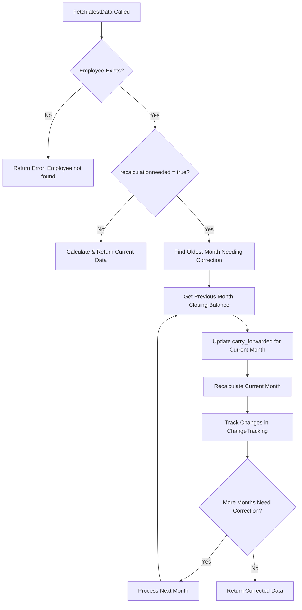

# Finance Dashboard Backend

A comprehensive employee data management and payroll calculation system with automated change tracking and data correction capabilities.

## 🚀 Features

- **Employee Data Management**: Complete CRUD operations for employee records
- **Automated Payroll Calculations**: Real-time wage, attendance, and balance calculations
- **Change Tracking System**: Full audit trail with serial-wise tracking of all data modifications
- **Smart Recalculation**: Automatic cascade corrections when data is modified
- **Data Integrity**: Comprehensive validation and error handling
- **Scalable Architecture**: Modular design with separation of concerns

## 🏗️ Architecture

```
Backend/
├── models/                 # Database schemas
│   ├── EmployeeSchema.js   # Employee data model
│   ├── ChangeTrackingSchema.js  # Change tracking model
│   └── ...
├── Routes/                 # API endpoints
│   ├── EmployeeDetails.js  # Employee management APIs
│   ├── changeTracking.js  # Change tracking APIs
│   └── ...
├── Utils/                  # Business logic utilities
│   ├── Jobs.js            # Core calculation engine
│   ├── ChangeTracker.js   # Change tracking system
│   └── ...
└── Middleware/            # Authentication & validation
    └── auth.js
```

## 🔧 Installation & Setup

```bash
# Clone the repository
git clone <repository-url>

# Navigate to backend directory
cd FinanceDashboard/Backend

# Install dependencies
npm install

# Set up environment variables
cp .env.example .env

# Start the server
npm start
```

## 📝 Environment Variables

```env
PORT=5000
MONGODB_URI=mongodb://localhost:27017/finance_dashboard
JWT_SECRET=your_jwt_secret_key
NODE_ENV=development
```

## 🌐 API Documentation

### Base URL
```
http://localhost:5000/api
```

---

## 👥 Employee Management APIs

### 1. Get Employees with Pending Payouts

**Endpoint**: `GET /employee/employeewithpendingpayouts`

**Description**: Retrieves all employees with non-zero closing balance (pending payouts) for a specific month/year/site. Automatically triggers recalculation if needed.

**Query Parameters**:
- `month` (required): Number (1-12) - The month to query
- `year` (required): Number (YYYY) - The year to query
- `siteID` (required): String - The site identifier

**Request Example**:
```bash
GET /api/employee/employeewithpendingpayouts?month=5&year=2025&siteID=SITE001
```

**Response Format**:
```json
{
  "success": true,
  "data": [
    {
      "_id": "663f7b1c4e4b0c1a2b3c4d5e6",
      "empid": "EMP001",
      "name": "John Doe",
      "rate": 500,
      "month": 5,
      "year": 2025,
      "siteID": "SITE001",
      "attendance": ["P", "P8", "A", "P4", "P"],
      "additional_req_pays": [
        {
          "description": "Performance Bonus",
          "value": 3000,
          "date": "2025-05-15T00:00:00.000Z"
        }
      ],
      "payouts": [
        {
          "description": "Advance Payment",
          "value": 2000,
          "date": "2025-05-10T00:00:00.000Z"
        }
      ],
      "carry_forwarded": {
        "value": 1500,
        "remark": "Previous month balance",
        "date": "2025-05-01T00:00:00.000Z"
      },
      "closing_balance": 15000,
      "totalWage": 12500,
      "totalPayouts": 2000,
      "carryForward": 1500,
      "totalAttendance": 26.5,
      "totalDays": 25,
      "totalovertime": 12,
      "overtimeDays": 1.5,
      "totalAdditionalReqPays": 3000
    }
  ],
  "message": "Found 5 employees with pending payouts for 5/2025",
  "totalProcessed": 10,
  "withPendingPayouts": 5
}
```

**Error Responses**:
```json
// 400 Bad Request
{
  "error": "Month and year are required."
}

// 500 Internal Server Error
{
  "success": false,
  "error": "Error fetching employee details.",
  "message": "Database connection failed"
}
```

**Frontend Usage**:
- Display employees who need to be paid
- Calculate total pending payouts for a site
- Generate payment reports
- Filter employees by closing balance

---

### 2. Get All Employees (Administrative)

**Endpoint**: `GET /employee/allemployees`

**Description**: Retrieves ALL employees for a specific month/year/site, including those with zero closing balance. Useful for administrative purposes and data verification.

**Query Parameters**:
- `month` (required): Number (1-12) - The month to query
- `year` (required): Number (YYYY) - The year to query
- `siteID` (required): String - The site identifier

**Request Example**:
```bash
GET /api/employee/allemployees?month=5&year=2025&siteID=SITE001
```

**Response Format**:
```json
{
  "success": true,
  "data": [
    {
      "_id": "663f7b1c4e4b0c1a2b3c4d5e6",
      "empid": "EMP001",
      "name": "John Doe",
      "closing_balance": 15000,
      "hasPendingPayouts": true,
      "needsRecalculation": false,
      // ... all other employee fields
    },
    {
      "_id": "663f7b1c4e4b0c1a2b3c4d5e7",
      "empid": "EMP002", 
      "name": "Jane Smith",
      "closing_balance": 0,
      "hasPendingPayouts": false,
      "needsRecalculation": true,
      // ... all other employee fields
    }
  ],
  "summary": {
    "total": 10,
    "withPendingPayouts": 5,
    "withZeroBalance": 4,
    "withErrors": 1
  },
  "message": "Found 10 employees for 5/2025"
}
```

**Frontend Usage**:
- Administrative dashboard showing all employees
- Data verification and audit reports
- Identify employees needing recalculation
- Generate comprehensive payroll reports

---

### 3. Add New Employee

**Endpoint**: `POST /employee/addemployeesimple`

**Description**: Creates a new employee with automatic serial number assignment and change tracking. Requires authentication middleware that provides user email in JWT token.

**Authentication**: Required (JWT token with user email)

**Request Body**:
```json
{
  "name": "John Doe",
  "siteID": "6833ff004bd307e45abbfb41",
  "wage": 600
}
```

**Request Parameters**:
- `name` (required): String - Employee name (non-empty)
- `siteID` (required): String - Site identifier (non-empty)
- `wage` (required): Number - Daily wage rate (must be > 0)

**Headers**:
```
Authorization: Bearer <jwt_token>
Content-Type: application/json
```

**Response Format**:
```json
{
  "success": true,
  "data": {
    "employee": {
      "_id": "663f7b1c4e4b0c1a2b3c4d5e9",
      "empid": "EMP03",
      "name": "John Doe",
      "rate": 600,
      "month": 5,
      "year": 2025,
      "siteID": "6833ff004bd307e45abbfb41",
      "payouts": [],
      "wage": 0,
      "additional_req_pays": [],
      "attendance": [],
      "closing_balance": 0,
      "carry_forwarded": {
        "value": 0,
        "remark": "Initial setup - new employee",
        "date": "2025-05-30T10:30:00.000Z"
      },
      "createdBy": "user@company.com",
      "attendanceHistory": {},
      "recalculationneeded": false,
      "createdAt": "2025-05-30T10:30:00.000Z",
      "updatedAt": "2025-05-30T10:30:00.000Z"
    },
    "changeTracking": {
      "serialNumber": 125,
      "changesRecorded": 15
    },
    "metadata": {
      "month": 5,
      "year": 2025,
      "rate": 600,
      "siteID": "6833ff004bd307e45abbfb41",
      "createdBy": "user@company.com"
    }
  },
  "message": "Employee John Doe (EMP03) created successfully for 5/2025 by user@company.com"
}
```

**Error Responses**:
```json
// 400 Bad Request - Missing fields
{
  "success": false,
  "error": "Employee name is required and cannot be empty."
}

// 400 Bad Request - Invalid wage
{
  "success": false,
  "error": "Wage must be provided and must be greater than 0."
}

// 409 Conflict - Employee already exists
{
  "success": false,
  "error": "Employee EMP03 already exists for 5/2025."
}

// 500 Internal Server Error
{
  "success": false,
  "error": "Error creating employee.",
  "message": "Database connection failed"
}
```

**Key Features**:
- ✅ **Auto Serial Assignment**: Automatically assigns next available EMP ID (EMP01, EMP02, etc.)
- ✅ **Change Tracking**: Records employee creation with full audit trail
- ✅ **Auth Integration**: Uses JWT token email for createdBy field
- ✅ **Default Values**: Sets current month/year and initializes all required fields
- ✅ **Validation**: Comprehensive input validation and error handling

**Frontend Usage**:
```javascript
// Example API call
const createEmployee = async (employeeData) => {
  try {
    const response = await fetch('/api/employee/addemployeesimple', {
      method: 'POST',
      headers: {
        'Content-Type': 'application/json',
        'Authorization': `Bearer ${localStorage.getItem('token')}`
      },
      body: JSON.stringify({
        name: employeeData.name,
        siteID: employeeData.siteID,
        wage: employeeData.dailyRate
      })
    });
    
    const result = await response.json();
    if (result.success) {
      console.log('Employee created:', result.data.employee.empid);
      return result.data;
    } else {
      throw new Error(result.error);
    }
  } catch (error) {
    console.error('Failed to create employee:', error);
    throw error;
  }
};
```

**Middleware Requirements**:
- Auth middleware must attach user information to `req.user`
- Expected fields: `req.user.email` or `req.user.userEmail`
- JWT token should contain user email for audit trail

---

## 🔄 Change Tracking APIs

### 1. Update Employee Data

**Endpoint**: `PUT /change-tracking/employee/:employeeID/update`

**Description**: Updates employee data for a specific month with automatic change tracking and future month cascade marking.

**Path Parameters**:
- `employeeID` (required): String - Employee identifier

**Request Body**:
```json
{
  "siteID": "SITE001",
  "month": 5,
  "year": 2025,
  "updateData": {
    "rate": 550,
    "additional_req_pays": [
      {
        "description": "Performance Bonus",
        "value": 5000,
        "date": "2025-05-15T00:00:00.000Z"
      }
    ],
    "payouts": [
      {
        "description": "Advance",
        "value": 3000,
        "date": "2025-05-20T00:00:00.000Z"
      }
    ]
  },
  "correctedBy": "admin_user",
  "remark": "Monthly salary adjustment and bonus addition"
}
```

**Response Format**:
```json
{
  "success": true,
  "message": "Employee EMP001 updated successfully for 5/2025",
  "data": {
    "serialNumber": 123,
    "updatedFields": ["rate", "additional_req_pays", "payouts"],
    "futureMonthsMarked": 7,
    "recalculationNeeded": true,
    "changeTrackingId": "663f7b1c4e4b0c1a2b3c4d5e8",
    "timestamp": "2025-05-29T10:30:00.000Z"
  }
}
```

**Key Features**:
- ✅ **Optimized Tracking**: Only tracks the month being edited
- ✅ **Smart Cascade**: Marks future months for recalculation
- ✅ **Automatic Recalculation**: Updates current month's closing balance
- ✅ **Deep Object Updates**: Handles complex nested data structures

---

### 2. Get Employee Change History

**Endpoint**: `GET /change-tracking/employee/:employeeID`

**Description**: Retrieves change tracking history for a specific employee with pagination and filtering options.

**Path Parameters**:
- `employeeID` (required): String - Employee identifier

**Query Parameters**:
- `siteID` (required): String - Site identifier
- `page` (optional): Number - Page number (default: 1)
- `limit` (optional): Number - Records per page (default: 20)
- `sortBy` (optional): String - Sort field (default: 'serialNumber')
- `sortOrder` (optional): String - 'asc' or 'desc' (default: 'desc')
- `fromDate` (optional): Date - Filter from date
- `toDate` (optional): Date - Filter to date
- `year` (optional): Number - Filter by year
- `month` (optional): Number - Filter by month

**Request Example**:
```bash
GET /api/change-tracking/employee/EMP001?siteID=SITE001&page=1&limit=10&year=2025
```

**Response Format**:
```json
{
  "records": [
    {
      "serialNumber": 123,
      "employeeID": "EMP001",
      "siteID": "SITE001",
      "correctionMonth": 5,
      "correctionYear": 2025,
      "correctedBy": "admin_user",
      "correctionDate": "2025-05-29T10:30:00.000Z",
      "remark": "Monthly salary adjustment",
      "summary": {
        "totalChanges": 3,
        "fieldsAdded": 1,
        "fieldsModified": 2,
        "fieldsRemoved": 0
      },
      "changes": [
        {
          "fieldPath": "rate",
          "changeType": "MODIFIED",
          "oldValue": 500,
          "newValue": 550,
          "oldDisplay": "500",
          "newDisplay": "550"
        }
      ]
    }
  ],
  "pagination": {
    "currentPage": 1,
    "totalPages": 5,
    "totalRecords": 47,
    "hasNext": true,
    "hasPrev": false
  }
}
```

---

### 3. Trigger Correction Process

**Endpoint**: `POST /change-tracking/correct-calculations`

**Description**: Manually triggers the Jobs.js correction process for employees marked as needing recalculation.

**Request Body**:
```json
{
  "siteID": "SITE001",
  "employeeID": "EMP001"  // Optional - if not provided, corrects all employees
}
```

**Response Format**:
```json
{
  "success": true,
  "data": {
    "type": "single",  // or "batch"
    "employeeID": "EMP001",
    "message": "Corrections completed for employee EMP001"
  },
  "timestamp": "2025-05-29T10:30:00.000Z"
}
```

---

### 4. Get Recalculation Status

**Endpoint**: `GET /change-tracking/needs-recalculation`

**Description**: Shows which employees need recalculation, grouped by employee with pagination.

**Query Parameters**:
- `siteID` (required): String - Site identifier
- `page` (optional): Number - Page number (default: 1)
- `limit` (optional): Number - Records per page (default: 50)

**Request Example**:
```bash
GET /api/change-tracking/needs-recalculation?siteID=SITE001&page=1&limit=10
```

**Response Format**:
```json
{
  "success": true,
  "data": {
    "employeesNeedingCorrection": 3,
    "totalRecordsNeedingCorrection": 15,
    "details": {
      "EMP001": [
        {
          "month": 6,
          "year": 2025,
          "period": "6/2025",
          "lastModified": "2025-05-29T10:30:00.000Z",
          "reason": "Cascade from 5/2025 update"
        }
      ]
    },
    "pagination": {
      "currentPage": 1,
      "totalPages": 2,
      "totalRecords": 15,
      "hasNext": true,
      "hasPrev": false
    }
  }
}
```

---

### 5. Get Change by Serial Number

**Endpoint**: `GET /change-tracking/serial/:serialNumber`

**Description**: Retrieve a specific change tracking record by its serial number for detailed view.

**Path Parameters**:
- `serialNumber` (required): Number - Serial number of the change record

**Request Example**:
```bash
GET /api/change-tracking/serial/123
```

**Response Format**:
```json
{
  "success": true,
  "data": {
    "serialNumber": 123,
    "employeeID": "EMP001",
    "siteID": "SITE001",
    "correctionMonth": 5,
    "correctionYear": 2025,
    "correctedBy": "admin_user",
    "correctionDate": "2025-05-29T10:30:00.000Z",
    "remark": "Monthly salary adjustment",
    "summary": {
      "totalChanges": 2,
      "fieldsAdded": 0,
      "fieldsModified": 2,
      "fieldsRemoved": 0
    },
    "changes": [
      {
        "fieldPath": "rate",
        "changeType": "MODIFIED",
        "oldValue": 500,
        "newValue": 550,
        "oldDisplay": "500",
        "newDisplay": "550"
      },
      {
        "fieldPath": "additional_req_pays.0.value",
        "changeType": "MODIFIED",
        "oldValue": 3000,
        "newValue": 5000,
        "oldDisplay": "3000",
        "newDisplay": "5000"
      }
    ]
  }
}
```

---

### 6. Get Change Tracking Statistics

**Endpoint**: `GET /change-tracking/statistics`

**Description**: Get comprehensive statistics about change tracking activities for analytics and reporting.

**Query Parameters**:
- `siteID` (optional): String - Filter by site
- `fromDate` (optional): Date - Filter from date
- `toDate` (optional): Date - Filter to date
- `year` (optional): Number - Filter by year
- `month` (optional): Number - Filter by month

**Request Example**:
```bash
GET /api/change-tracking/statistics?siteID=SITE001&year=2025&month=5
```

**Response Format**:
```json
{
  "success": true,
  "data": {
    "totalChanges": 156,
    "activeEmployees": 45,
    "totalEmployees": 50,
    "summary": {
      "fieldsAdded": 23,
      "fieldsModified": 128,
      "fieldsRemoved": 5
    },
    "byEmployee": [
      {
        "employeeID": "EMP001",
        "changeCount": 12,
        "lastChange": "2025-05-29T10:30:00.000Z"
      }
    ],
    "byCorrector": [
      {
        "correctedBy": "admin_user",
        "changeCount": 89,
        "percentage": 57.1
      }
    ],
    "byMonth": [
      {
        "month": 5,
        "year": 2025,
        "changeCount": 67,
        "employeeCount": 23
      }
    ],
    "trends": {
      "averageChangesPerEmployee": 3.47,
      "mostActiveDay": "2025-05-15",
      "peakActivity": "14:30"
    }
  }
}
```

---

### 7. Get Recent Changes

**Endpoint**: `GET /change-tracking/recent`

**Description**: Get the most recent change tracking activities across all employees for monitoring and dashboard purposes.

**Query Parameters**:
- `limit` (optional): Number - Maximum records to return (default: 50)
- `siteID` (optional): String - Filter by site

**Request Example**:
```bash
GET /api/change-tracking/recent?limit=10&siteID=SITE001
```

**Response Format**:
```json
{
  "success": true,
  "data": [
    {
      "serialNumber": 125,
      "employeeID": "EMP003",
      "employeeName": "Alice Johnson",
      "siteID": "SITE001",
      "correctionMonth": 5,
      "correctionYear": 2025,
      "correctedBy": "admin_user",
      "correctionDate": "2025-05-29T15:45:00.000Z",
      "remark": "Overtime adjustment",
      "changeCount": 1,
      "timeAgo": "2 hours ago"
    }
  ],
  "meta": {
    "totalRecords": 10,
    "lastUpdate": "2025-05-29T15:45:00.000Z",
    "filters": {
      "siteID": "SITE001",
      "limit": 10
    }
  }
}
```

---

### 8. Get Change Tracking Dashboard

**Endpoint**: `GET /change-tracking/dashboard`

**Description**: Get dashboard data with key metrics, recent activities, and trends for administrative overview.

**Query Parameters**:
- `siteID` (optional): String - Filter by site
- `dateRange` (optional): Number - Days to look back (default: 30)

**Request Example**:
```bash
GET /api/change-tracking/dashboard?siteID=SITE001&dateRange=7
```

**Response Format**:
```json
{
  "success": true,
  "data": {
    "summary": {
      "totalChanges": 89,
      "activeEmployees": 34,
      "totalEmployees": 50,
      "averageChangesPerDay": 12.7,
      "mostActiveCorrector": "admin_user"
    },
    "recentActivity": [
      {
        "date": "2025-05-29",
        "changeCount": 15,
        "employeeCount": 8
      }
    ],
    "topEmployees": [
      {
        "employeeID": "EMP001",
        "name": "John Doe",
        "changeCount": 8,
        "lastChange": "2025-05-29T15:45:00.000Z"
      }
    ],
    "changeTypes": {
      "MODIFIED": 67,
      "ADDED": 18,
      "REMOVED": 4
    },
    "alerts": [
      {
        "type": "high_activity",
        "message": "Employee EMP001 has been modified 8 times in the last 7 days",
        "severity": "warning"      }
    ]
  }
}
```

---

### 9. Bulk Update Employee Attendance

**Endpoint**: `PUT /change-tracking/attendance/updateattendance`

**Description**: Updates attendance data for multiple employees in a single transaction using an "All or Nothing" approach. Either all employees get updated successfully, or none of them do, ensuring data consistency.

**Authentication**: Required (JWT token)

**Request Body**:
```json
{
  "month": "2025-05",
  "siteID": "6833ff004bd307e45abbfb41",
  "attendanceData": [
    {
      "id": "EMP001",
      "name": "Rajesh Kumar",
      "attendance": [
        "P1", "P", "P", "P", "P", "P", "P", "P", "P", "P",
        "P", "P", "P", "P", "P4", "P3", "P", "P", "P", "P",
        "P3", "P", "P", "P2", "P", "P", "P", "P", "P", "P", "P"
      ]
    },
    {
      "id": "EMP002", 
      "name": "Priya Sharma",
      "attendance": [
        "P", "P", "A", "P", "P", "P", "P8", "P", "P", "P",
        "P", "A", "P", "P", "P", "P", "P", "P4", "P", "P",
        "P", "P", "P", "P", "P", "A", "P", "P", "P", "P", "P"
      ]
    }
  ]
}
```

**Request Parameters**:
- `month` (required): String - Month in "YYYY-MM" format (e.g., "2025-05")
- `siteID` (required): String - Site identifier
- `attendanceData` (required): Array - Array of employee attendance objects
  - `id` (required): String - Employee ID
  - `name` (required): String - Employee name (for validation)
  - `attendance` (required): Array - Array of attendance strings

**Attendance Codes**:
- `P` - Present (1 day)
- `P4` - Present with 4 hours overtime
- `P8` - Present with 8 hours overtime  
- `A` - Absent (0 days)
- Numbers after P indicate overtime hours

**Response Format**:

**Success (All Updated)**:
```json
{
  "success": true,
  "message": "All attendance data updated successfully. 2 employees processed.",
  "summary": {
    "totalEmployees": 2,
    "successful": 2,
    "failed": 0,
    "month": 5,
    "year": 2025,
    "siteID": "6833ff004bd307e45abbfb41",
    "transactionId": "64a7b8c9d1e2f3a4b5c6d7e8"
  },
  "results": [
    {
      "employeeID": "EMP001",
      "employeeName": "Rajesh Kumar",
      "success": true,
      "serialNumber": 126,
      "attendanceLength": 31,
      "message": "Attendance updated successfully"
    },
    {
      "employeeID": "EMP002",
      "employeeName": "Priya Sharma", 
      "success": true,
      "serialNumber": 127,
      "attendanceLength": 31,
      "message": "Attendance updated successfully"
    }
  ],
  "timestamp": "2025-05-31T10:30:00.000Z"
}
```

**Failure (None Updated)**:
```json
{
  "success": false,
  "message": "Validation failed for 1 employees. No data was updated.",
  "validationErrors": [
    {
      "employeeID": "EMP999",
      "employeeName": "Non Existent",
      "error": "Employee EMP999 not found for 5/2025 at site 6833ff004bd307e45abbfb41"
    }
  ],
  "totalEmployees": 2,
  "timestamp": "2025-05-31T10:30:00.000Z"
}
```

**Key Features**:
- ✅ **Transactional**: All-or-nothing approach prevents partial updates
- ✅ **Pre-validation**: Validates all employees exist before making changes
- ✅ **Change Tracking**: Creates change tracking records for each employee
- ✅ **Future Marking**: Automatically marks future months for recalculation
- ✅ **Audit Trail**: Complete audit trail with user attribution
- ✅ **Data Integrity**: Transaction rollback on any failure

**Error Responses**:
```json
// 400 Bad Request - Missing fields
{
  "success": false,
  "message": "Missing required fields: month, siteID, and attendanceData (array) are required",
  "example": {
    "month": "2025-05",
    "siteID": "6833ff004bd307e45abbfb41",
    "attendanceData": [...]
  }
}

// 400 Bad Request - Invalid month format
{
  "success": false,
  "message": "Invalid month format. Expected format: \"YYYY-MM\" (e.g., \"2025-05\")"
}

// 400 Bad Request - Invalid attendance data
{
  "success": false,
  "message": "Each attendance data entry must have id, name, and attendance array",
  "invalidEntry": {
    "id": "EMP001",
    "name": null,
    "attendance": "invalid"
  }
}

// 500 Internal Server Error
{
  "success": false,
  "message": "Internal server error during attendance update. All changes have been rolled back.",
  "timestamp": "2025-05-31T10:30:00.000Z"
}
```

**Process Flow**:
1. **Validation Phase**: Validates all employees exist for the specified month/year/site
2. **Transaction Start**: Begins database transaction
3. **Update Phase**: Updates all employee attendance data within the transaction
4. **Change Tracking**: Creates change tracking records for audit trail
5. **Future Marking**: Marks future months for recalculation
6. **Commit/Rollback**: Commits transaction if all succeed, or rolls back if any fail

**Frontend Usage**:
- Bulk attendance import from Excel/CSV files
- Monthly attendance sheet updates
- Administrative corrections for multiple employees
- Payroll preparation workflows

---

### 10. Get All Change Records (Advanced)

**Endpoint**: `GET /change-tracking/all`

**Description**: Advanced endpoint for fetching all change records with comprehensive filtering, sorting, and pagination options.

**Query Parameters**:
- `page` (optional): Number - Page number (default: 1)
- `limit` (optional): Number - Records per page (default: 50)
- `siteID` (optional): String - Filter by site
- `employeeID` (optional): String - Filter by employee
- `fromDate` (optional): Date - Filter from date
- `toDate` (optional): Date - Filter to date
- `year` (optional): Number - Filter by year
- `month` (optional): Number - Filter by month
- `correctedBy` (optional): String - Filter by who made the correction
- `changeType` (optional): String - Filter by change type ('ADDED', 'MODIFIED', 'REMOVED')
- `sortBy` (optional): String - Sort field (default: 'serialNumber')
- `sortOrder` (optional): String - 'asc' or 'desc' (default: 'desc')

**Request Example**:
```bash
GET /api/change-tracking/all?page=1&limit=20&siteID=SITE001&year=2025&sortBy=correctionDate&sortOrder=desc
```

**Response Format**:
```json
{
  "success": true,
  "data": [
    {
      "serialNumber": 125,
      "employeeID": "EMP001",
      "siteID": "SITE001",
      "correctionMonth": 5,
      "correctionYear": 2025,
      "correctedBy": "admin_user",
      "correctionDate": "2025-05-29T15:45:00.000Z",
      "remark": "Rate adjustment",
      "summary": {
        "totalChanges": 1,
        "fieldsAdded": 0,
        "fieldsModified": 1,
        "fieldsRemoved": 0
      },
      "changes": [
        {
          "fieldPath": "rate",
          "changeType": "MODIFIED",
          "oldValue": 500,
          "newValue": 550,
          "oldDisplay": "500",
          "newDisplay": "550"
        }
      ]
    }
  ],
  "pagination": {
    "currentPage": 1,
    "totalPages": 8,
    "totalRecords": 156,
    "recordsPerPage": 20,
    "hasNextPage": true,
    "hasPrevPage": false
  },
  "filters": {
    "siteID": "SITE001",
    "year": 2025,
    "sortBy": "correctionDate",
    "sortOrder": "desc"
  }
}
```

---

## 🧪 API Testing

### Postman Collection

Use these requests to test the API endpoints:

#### 1. Employee Management Tests

```javascript
// Test 1: Get employees with pending payouts
GET {{baseURL}}/api/employee/employeewithpendingpayouts?month=5&year=2025&siteID=SITE001
Authorization: Bearer {{token}}

// Test 2: Get all employees  
GET {{baseURL}}/api/employee/allemployees?month=5&year=2025&siteID=SITE001
Authorization: Bearer {{token}}
```

#### 2. Change Tracking Tests

```javascript
// Test 3: Update employee data
PUT {{baseURL}}/api/change-tracking/employee/EMP001/update
Authorization: Bearer {{token}}
Content-Type: application/json

{
  "siteID": "SITE001",
  "month": 5,
  "year": 2025,
  "updateData": {
    "rate": 550,
    "additional_req_pays": [
      {
        "description": "Performance Bonus",
        "value": 5000,
        "date": "2025-05-29T00:00:00.000Z"
      }
    ]
  },
  "correctedBy": "test_user",
  "remark": "API testing - rate adjustment"
}

// Test 4: Get change history
GET {{baseURL}}/api/change-tracking/employee/EMP001?siteID=SITE001&page=1&limit=10
Authorization: Bearer {{token}}

// Test 5: Trigger corrections
POST {{baseURL}}/api/change-tracking/correct-calculations
Authorization: Bearer {{token}}
Content-Type: application/json

{
  "siteID": "SITE001"
}
```

#### 3. Monitoring & Statistics Tests

```javascript
// Test 6: Get statistics
GET {{baseURL}}/api/change-tracking/statistics?siteID=SITE001&year=2025&month=5
Authorization: Bearer {{token}}

// Test 7: Get dashboard data
GET {{baseURL}}/api/change-tracking/dashboard?siteID=SITE001&dateRange=7
Authorization: Bearer {{token}}

// Test 8: Check recalculation needs
GET {{baseURL}}/api/change-tracking/needs-recalculation?siteID=SITE001
Authorization: Bearer {{token}}
```

### Test Data Setup

Create test employees for testing:

```javascript
// Sample test employee data
const testEmployees = [
  {
    empid: "TEST001",
    name: "Test Employee 1", 
    rate: 500,
    month: 5,
    year: 2025,
    siteID: "SITE001",
    attendance: ["P", "P", "P8", "A", "P", "P4", "P", "P", "P", "P"],
    additional_req_pays: [
      {
        description: "Initial Bonus",
        value: 2000,
        date: "2025-05-15T00:00:00.000Z"
      }
    ],
    payouts: [],
    carry_forwarded: {
      value: 1000,
      remark: "Previous month balance",
      date: "2025-05-01T00:00:00.000Z"
    }
  }
];
```

### Automated Testing Script

```javascript
// test-api.js - Run with Node.js
const axios = require('axios');

const baseURL = 'http://localhost:5000';
const token = 'your_jwt_token_here';

const api = axios.create({
  baseURL: baseURL,
  headers: {
    'Authorization': `Bearer ${token}`,
    'Content-Type': 'application/json'
  }
});

async function runTests() {
  console.log('🧪 Starting API Tests...\n');
  
  try {
    // Test 1: Get pending payouts
    console.log('📋 Test 1: Getting employees with pending payouts');
    const pendingResponse = await api.get('/api/employee/employeewithpendingpayouts?month=5&year=2025&siteID=SITE001');
    console.log(`✅ Found ${pendingResponse.data.data.length} employees with pending payouts\n`);
    
    // Test 2: Update employee
    console.log('📝 Test 2: Updating employee data');
    const updateResponse = await api.put('/api/change-tracking/employee/EMP001/update', {
      siteID: 'SITE001',
      month: 5,
      year: 2025,
      updateData: {
        rate: 550
      },
      correctedBy: 'api_test',
      remark: 'Automated test rate update'
    });
    console.log(`✅ Employee updated. Serial: ${updateResponse.data.data.serialNumber}\n`);
    
    // Test 3: Get change history
    console.log('📚 Test 3: Getting change history');
    const historyResponse = await api.get('/api/change-tracking/employee/EMP001?siteID=SITE001&limit=5');
    console.log(`✅ Found ${historyResponse.data.records.length} change records\n`);
    
    // Test 4: Check statistics
    console.log('📊 Test 4: Getting statistics');
    const statsResponse = await api.get('/api/change-tracking/statistics?siteID=SITE001');
    console.log(`✅ Statistics: ${statsResponse.data.data.totalChanges} total changes\n`);
    
    console.log('🎉 All tests passed successfully!');
    
  } catch (error) {
    console.error('❌ Test failed:', error.response?.data || error.message);
  }
}

runTests();
```

### Performance Testing

```bash
# Install Apache Bench for load testing
# Test employee endpoint under load
ab -n 1000 -c 10 -H "Authorization: Bearer your_token" \
   "http://localhost:5000/api/employee/employeewithpendingpayouts?month=5&year=2025&siteID=SITE001"

# Test change tracking endpoint
ab -n 500 -c 5 -H "Authorization: Bearer your_token" \
   "http://localhost:5000/api/change-tracking/recent?siteID=SITE001&limit=20"
```

---

## 🚀 Deployment Guide

### Development Environment

```bash
# 1. Clone and setup
git clone <repository-url>
cd FinanceDashboard/Backend
npm install

# 2. Environment setup
cp .env.example .env
# Edit .env with your configurations

# 3. Start development server
npm run dev

# 4. Verify installation
curl http://localhost:5000/api/health
```

### Production Deployment

#### Option 1: Traditional Server (Ubuntu/CentOS)

```bash
# 1. Server setup
sudo apt update
sudo apt install nodejs npm nginx mongodb
sudo systemctl start mongodb
sudo systemctl enable mongodb

# 2. Application deployment
git clone <repository-url> /var/www/finance-dashboard
cd /var/www/finance-dashboard/Backend
npm ci --production

# 3. Environment configuration
sudo nano /var/www/finance-dashboard/Backend/.env
```

```env
NODE_ENV=production
PORT=5000
MONGODB_URI=mongodb://localhost:27017/finance_dashboard_prod
JWT_SECRET=your_super_secure_production_secret_key_here
LOG_LEVEL=info
```

```bash
# 4. Process manager (PM2)
sudo npm install -g pm2
pm2 start server.js --name "finance-dashboard-backend"
pm2 startup
pm2 save

# 5. Nginx reverse proxy
sudo nano /etc/nginx/sites-available/finance-dashboard
```

```nginx
server {
    listen 80;
    server_name your-domain.com;
    
    location /api {
        proxy_pass http://localhost:5000;
        proxy_http_version 1.1;
        proxy_set_header Upgrade $http_upgrade;
        proxy_set_header Connection 'upgrade';
        proxy_set_header Host $host;
        proxy_set_header X-Real-IP $remote_addr;
        proxy_set_header X-Forwarded-For $proxy_add_x_forwarded_for;
        proxy_set_header X-Forwarded-Proto $scheme;
        proxy_cache_bypass $http_upgrade;
    }
}
```

```bash
# 6. Enable site and restart nginx
sudo ln -s /etc/nginx/sites-available/finance-dashboard /etc/nginx/sites-enabled/
sudo nginx -t
sudo systemctl reload nginx

# 7. SSL with Let's Encrypt
sudo apt install certbot python3-certbot-nginx
sudo certbot --nginx -d your-domain.com
```

#### Option 2: Docker Deployment

```dockerfile
# Dockerfile
FROM node:18-alpine

WORKDIR /app

# Copy package files
COPY package*.json ./
RUN npm ci --production

# Copy application code
COPY . .

# Create non-root user
RUN addgroup -g 1001 -S nodejs
RUN adduser -S nodejs -u 1001

# Change ownership
RUN chown -R nodejs:nodejs /app
USER nodejs

EXPOSE 5000

CMD ["node", "server.js"]
```

```yaml
# docker-compose.yml
version: '3.8'

services:
  backend:
    build: .
    ports:
      - "5000:5000"
    environment:
      - NODE_ENV=production
      - MONGODB_URI=mongodb://mongo:27017/finance_dashboard
      - JWT_SECRET=${JWT_SECRET}
    depends_on:
      - mongo
    volumes:
      - ./logs:/app/logs
    restart: unless-stopped

  mongo:
    image: mongo:6.0
    ports:
      - "27017:27017"
    volumes:
      - mongo_data:/data/db
      - ./mongo-init:/docker-entrypoint-initdb.d
    restart: unless-stopped

  nginx:
    image: nginx:alpine
    ports:
      - "80:80"
      - "443:443"
    volumes:
      - ./nginx.conf:/etc/nginx/nginx.conf
      - ./ssl:/etc/ssl
    depends_on:
      - backend
    restart: unless-stopped

volumes:
  mongo_data:
```

```bash
# Deploy with Docker
docker-compose up -d

# Check logs
docker-compose logs -f backend

# Update deployment
git pull
docker-compose build backend
docker-compose up -d backend
```

#### Option 3: Cloud Deployment (AWS/Digital Ocean)

```bash
# 1. Create cloud instance
# 2. Install Docker and Docker Compose
curl -fsSL https://get.docker.com -o get-docker.sh
sh get-docker.sh
sudo usermod -aG docker $USER

# 3. Clone and deploy
git clone <repository-url>
cd FinanceDashboard/Backend
cp .env.example .env
# Edit .env with production values

# 4. Deploy with Docker Compose
docker-compose -f docker-compose.prod.yml up -d

# 5. Setup monitoring
docker run -d --name watchtower \
  -v /var/run/docker.sock:/var/run/docker.sock \
  containrrr/watchtower --interval 30
```

### Database Backup & Monitoring

```bash
# Automated backup script
#!/bin/bash
# backup.sh

DATE=$(date +%Y%m%d_%H%M%S)
BACKUP_DIR="/var/backups/finance-dashboard"
DB_NAME="finance_dashboard"

# Create backup directory
mkdir -p $BACKUP_DIR

# MongoDB backup
mongodump --db $DB_NAME --out $BACKUP_DIR/mongo_$DATE

# Compress backup
tar -czf $BACKUP_DIR/backup_$DATE.tar.gz $BACKUP_DIR/mongo_$DATE

# Remove old backups (keep last 7 days)
find $BACKUP_DIR -name "backup_*.tar.gz" -mtime +7 -delete
find $BACKUP_DIR -name "mongo_*" -mtime +1 -type d -exec rm -rf {} +

echo "Backup completed: backup_$DATE.tar.gz"
```

```bash
# Add to crontab for daily backups
crontab -e
# Add line: 0 2 * * * /path/to/backup.sh
```

### Monitoring & Alerts

```bash
# Health check script
#!/bin/bash
# health-check.sh

API_URL="http://localhost:5000/api/health"
ALERT_EMAIL="admin@yourcompany.com"

# Check API health
RESPONSE=$(curl -s -o /dev/null -w "%{http_code}" $API_URL)

if [ $RESPONSE -ne 200 ]; then
    echo "API Health Check Failed - HTTP $RESPONSE" | \
    mail -s "Finance Dashboard Alert" $ALERT_EMAIL
    
    # Restart service if needed
    pm2 restart finance-dashboard-backend
fi

# Check disk space
DISK_USAGE=$(df / | tail -1 | awk '{print $5}' | sed 's/%//')
if [ $DISK_USAGE -gt 80 ]; then
    echo "Disk usage is at ${DISK_USAGE}%" | \
    mail -s "Disk Space Warning" $ALERT_EMAIL
fi
```

### Security Checklist

- ✅ Use strong JWT secrets (32+ characters)
- ✅ Enable HTTPS/SSL in production
- ✅ Configure firewall (only open ports 80, 443, 22)
- ✅ Regular security updates
- ✅ Database access restrictions
- ✅ Rate limiting on API endpoints
- ✅ Input validation and sanitization
- ✅ Error logging without sensitive data exposure
- ✅ Regular backups with encryption
- ✅ Monitor for suspicious activities

---

## 🧠 Backend Logic Deep Dive

This section provides a detailed explanation of all backend logic to help diagnose unexpected API results and understand the complete data flow.

---

## 📁 Utils Folder - Core Business Logic

### 1. Jobs.js - Employee Data Calculation Engine

#### **Purpose**: Core calculation and data correction system for employee records

#### **Key Functions & Logic**:

##### `calculateEmployeeData(employee)`
**Purpose**: Calculate all derived fields for an employee record

**Input**: Raw employee object with basic data
**Output**: Employee object with calculated totals

**Logic Flow**:
```javascript
// 1. ATTENDANCE PROCESSING
attendance: ["P", "P8", "A", "P4", "P"] 
→ processAttendanceData()
  → "P" = 1 day (present)
  → "A" = 0 days (absent) 
  → "P4" = 0.5 days (half day)
  → "P8" = 1.5 days (1 day + 0.5 overtime)
  → "P6", "P10" etc. = 1 day + (hours-8)/8 overtime

// 2. WAGE CALCULATION
totalWage = rate × (totalDays + overtimeDays)
Example: 500 × (22 + 1.5) = 11,750

// 3. BALANCE CALCULATION  
closing_balance = totalWage - totalPayouts + totalAdditionalReqPays + carryForward
Example: 11,750 - 2,000 + 3,000 + 1,500 = 14,250
```

**Error Diagnosis**:
- ❌ If closing_balance wrong → Check attendance parsing or rate calculation
- ❌ If totalWage wrong → Check attendance array format or rate value
- ❌ If calculations missing → Check for null/undefined in arrays

##### `FetchlatestData(siteID, employeeID, month, year)`
**Purpose**: Get employee data with automatic correction if needed

**Logic Flow**:


**Error Diagnosis**:
- ❌ If recalculation loops → Check for circular dependencies in carry_forwarded
- ❌ If data not updating → Check if `recalculationneeded` flag is set correctly
- ❌ If previous month balance wrong → Check month sequence and data integrity

##### `CorrectCalculations(siteID, employeeID)`
**Purpose**: Fix calculation errors by recalculating from the oldest incorrect month

**Algorithm**:
```javascript
1. Find all months where recalculationneeded = true
2. Sort by year, month (oldest first)
3. For each month:
   a. Get previous month's closing_balance as carry_forwarded  
   b. Recalculate current month totals
   c. Update database with new values
   d. Track changes in ChangeTracking
   e. Set recalculationneeded = false
```

**Error Diagnosis**:
- ❌ If corrections fail → Check database connectivity and schema validation
- ❌ If some months skip → Check sort logic and month sequencing
- ❌ If carry forward wrong → Verify previous month exists and has valid closing_balance

#### **Helper Functions**:

##### `processAttendanceData(attendance)`
**Purpose**: Parse attendance strings and calculate working days/overtime

**Parsing Logic**:
```javascript
"P"   → 1.0 days (standard present)
"A"   → 0.0 days (absent)
"P4"  → 0.5 days (4 hours = half day)
"P8"  → 1.5 days (8 hours regular + overtime bonus)
"P10" → 1.25 days (8 hours regular + 2 hours overtime/8)
"P12" → 1.5 days (8 hours regular + 4 hours overtime/8)
```

**Overtime Calculation**:
```javascript
// For entries like "P10", "P12" etc.
const hours = parseInt(entry.substring(1)); // Extract number
const regularDays = 1; // Always 1 for present
const overtimeHours = Math.max(0, hours - 8); // Hours beyond 8
const overtimeDays = overtimeHours / 8; // Convert to day fraction
totalDays += regularDays;
totalOvertime += overtimeHours;
```

##### `getRecalculationStatus(siteID)`
**Purpose**: Check which employees need recalculation

**Query Logic**:
```javascript
Employee.find({
  siteID: siteID,
  recalculationneeded: true
}).sort({ year: 1, month: 1, empid: 1 })
```

##### `markEmployeesForRecalculation(siteID, employeeID, fromMonth, fromYear)`
**Purpose**: Mark future months for recalculation after data changes

**Cascade Logic**:
```javascript
// Mark all months >= fromMonth/fromYear as needing recalculation
Employee.updateMany({
  siteID: siteID,
  empid: employeeID,
  $or: [
    { year: { $gt: fromYear } },
    { year: fromYear, month: { $gte: fromMonth } }
  ]
}, {
  $set: { recalculationneeded: true }
})
```

---

### 2. ChangeTracker.js - Data Change Management System

#### **Purpose**: Track, store, and query all changes made to employee data

#### **Key Functions & Logic**:

##### `TrackChanges(originalData, updatedData, siteID, employeeID, month, year, correctedBy, remark)`
**Purpose**: Deep comparison and change tracking

**Logic Flow**:
```javascript
1. DEEP COMPARISON
   → findDeepDifferences(originalData, updatedData)
   → Compare every field recursively
   → Identify ADDED, MODIFIED, REMOVED changes

2. CHANGE CATEGORIZATION
   → fieldPath: "rate" | "payouts.0.value" | "attendance.5"
   → changeType: "ADDED" | "MODIFIED" | "REMOVED" 
   → oldValue/newValue: Actual data values
   → oldDisplay/newDisplay: Human-readable format

3. SERIAL NUMBER GENERATION
   → Auto-increment for frontend tracking
   → Unique across all sites and employees

4. DATABASE PERSISTENCE
   → Save to ChangeTracking collection
   → Include summary statistics
```

**Change Detection Algorithm**:
```javascript
// For each field in both objects
allKeys = union(keys(oldObj), keys(newObj))
forEach(key => {
  if (!isEqual(oldValue, newValue)) {
    // Determine change type
    if (oldValue === undefined) changeType = "ADDED"
    else if (newValue === undefined) changeType = "REMOVED"  
    else changeType = "MODIFIED"
    
    // Store change details
    changes.push({
      fieldPath: currentPath,
      changeType: changeType,
      oldValue: cloneDeep(oldValue),
      newValue: cloneDeep(newValue)
    })
  }
})
```

##### `updateEmployeeData(siteID, employeeID, month, year, updateData, correctedBy, remark)`
**Purpose**: Update employee with optimized change tracking

**Optimization Logic**:
```javascript
1. CURRENT MONTH TRACKING ONLY
   → Only track changes for the month being edited
   → Avoid duplicate tracking for future months

2. CASCADE MARKING
   → Mark future months: recalculationneeded = true
   → Trigger recalculation without tracking each future change

3. AUTOMATIC RECALCULATION
   → Immediately recalculate current month's closing_balance
   → Ensure data consistency
```

**Error Diagnosis**:
- ❌ If changes not tracked → Check data structure comparison logic
- ❌ If serial numbers duplicate → Check auto-increment sequence
- ❌ If cascade marking fails → Verify month/year filtering logic

##### **Helper Functions**:

##### `findDeepDifferences(oldObj, newObj, path)`
**Purpose**: Recursively compare complex objects

**Algorithm**:
```javascript
// Handle arrays vs objects differently
if (isArray(oldValue) && isArray(newValue)) {
  // Compare array elements by index
  maxLength = max(oldValue.length, newValue.length)
  for (i = 0; i < maxLength; i++) {
    compare(oldValue[i], newValue[i], `${path}.${i}`)
  }
}
else if (isObject(oldValue) && isObject(newValue)) {
  // Recursively compare object properties
  allKeys = union(keys(oldValue), keys(newValue))
  forEach(key => {
    compare(oldValue[key], newValue[key], `${path}.${key}`)
  })
}
```

##### `formatValueForDisplay(value)`
**Purpose**: Create human-readable representations

**Formatting Logic**:
```javascript
// Arrays: [item1, item2, ... N more items]
// Objects: {key1: value1, key2: value2, ... N more}
// Primitives: Direct string representation
// Dates: ISO string format
// Complex: Truncated with preview
```

---

## 📊 Models - Data Structure Logic

### 1. EmployeeSchema.js - Core Data Model

#### **Data Structure**:
```javascript
{
  // BASIC INFO
  empid: String (required, unique per month/year)
  name: String (required)
  rate: Number (required, min: 0)
  month: Number (required, 1-12)
  year: Number (required, 2000-current+1)
  siteID: ObjectId (required, ref: 'Site')
  
  // PAYMENT DATA
  additional_req_pays: [
    {
      value: Number (required, min: 0),
      remark: String (required),
      date: Date (default: now)
    }
  ],
  payouts: [
    {
      value: Number,
      remark: String,
      date: Date,
      createdBy: String (required)
    }
  ],
  
  // ATTENDANCE  
  attendance: [String] // ["P", "P8", "A", "P4"]
  
  // CALCULATED FIELDS
  wage: Number (required, min: 0)
  closing_balance: Number (default: 0)
  carry_forwarded: {
    value: Number (default: 0),
    remark: String (default: ''),
    date: Date (default: now)
  },
  
  // SYSTEM FIELDS
  recalculationneeded: Boolean (default: false)
  createdBy: String (required)
  attendanceHistory: Map // For audit trail
}
```

#### **Business Rules**:
1. **Unique Constraint**: `empid + month + year` must be unique
2. **Validation**: All monetary values must be ≥ 0
3. **Relationships**: `siteID` must reference valid Site document
4. **Auto-Calculation**: `closing_balance` recalculated on data changes

#### **Index Strategy**:
```javascript
// Primary queries
{ empid: 1, month: 1, year: 1 } // Unique constraint
{ siteID: 1, month: 1, year: 1 } // Site-based queries
{ recalculationneeded: 1 } // Correction queries
{ "closing_balance": 1 } // Payout queries
```

### 2. ChangeTrackingSchema.js - Audit Trail Model

#### **Data Structure**:
```javascript
{
  // TRACKING INFO
  serialNumber: Number (auto-increment, unique)
  siteID: String (required)
  employeeID: String (required)
  correctionMonth: Number (required)
  correctionYear: Number (required)
  
  // AUDIT INFO  
  correctedBy: String (required)
  correctionDate: Date (default: now)
  remark: String
  
  // CHANGE SUMMARY
  summary: {
    totalChanges: Number,
    fieldsAdded: Number,
    fieldsModified: Number,
    fieldsRemoved: Number
  },
  
  // DETAILED CHANGES
  changes: [
    {
      fieldPath: String, // "rate", "payouts.0.value"
      changeType: String, // "ADDED", "MODIFIED", "REMOVED"
      oldValue: Mixed,
      newValue: Mixed,
      oldDisplay: String, // Human readable
      newDisplay: String
    }
  ]
}
```

#### **Query Optimization**:
```javascript
// Performance indexes
{ serialNumber: 1 } // Serial lookup
{ siteID: 1, employeeID: 1, correctionDate: -1 } // Employee history
{ correctionDate: -1 } // Recent changes
{ siteID: 1, correctionYear: 1, correctionMonth: 1 } // Period reports
```

---

## 🔄 API Logic Flow

### Employee Management APIs

#### `GET /employee/employeewithpendingpayouts`

**Logic Flow**:
```javascript
1. VALIDATE PARAMETERS
   → month (1-12), year (2000+), siteID (valid ObjectId)

2. QUERY DATABASE
   → Find employees for month/year/site
   → Filter where closing_balance > 0

3. AUTO-CORRECTION CHECK
   → For each employee: if recalculationneeded = true
   → Call FetchlatestData() to trigger correction
   → Recalculate closing_balance

4. RESPONSE FORMATTING
   → Include calculated totals
   → Add summary statistics
   → Return with pagination metadata
```

**Error Scenarios**:
- ❌ No employees found → Empty array with success: true
- ❌ Calculation errors → Log error, continue with other employees
- ❌ Database errors → Return 500 with error details

#### `GET /employee/allemployees`

**Logic Flow**:
```javascript
1. SIMILAR TO PENDING PAYOUTS
   → Same validation and auto-correction

2. KEY DIFFERENCE  
   → Return ALL employees (closing_balance >= 0)
   → Include administrative fields
   → Add recalculation status flags

3. SUMMARY CALCULATION
   → Count employees by status
   → Calculate totals and averages
```

### Change Tracking APIs

#### `PUT /change-tracking/employee/:employeeID/update`

**Logic Flow**:
```javascript
1. VALIDATION
   → Check required fields
   → Validate month/year ranges  
   → Ensure updateData is valid object

2. FETCH CURRENT DATA
   → Get existing employee record
   → Store original for comparison

3. APPLY UPDATES
   → Deep merge updateData into employee
   → Preserve non-updated fields

4. OPTIMIZED TRACKING
   → Track changes ONLY for current month
   → Mark future months: recalculationneeded = true
   → Avoid duplicate change records

5. IMMEDIATE RECALCULATION
   → Recalculate current month closing_balance
   → Update database with new values

6. RESPONSE
   → Return change tracking details
   → Include cascade marking summary
```

**Error Scenarios**:
- ❌ Employee not found → 404 with specific message
- ❌ Invalid updateData → 400 with validation details
- ❌ Database errors → 500 with error context

#### `GET /change-tracking/employee/:employeeID`

**Logic Flow**:
```javascript
1. PARAMETER PROCESSING
   → Parse pagination (page, limit)
   → Parse filters (dates, changeType, etc.)
   → Parse sorting (field, direction)

2. QUERY BUILDING
   → Build MongoDB aggregation pipeline
   → Add filters and sorting
   → Add pagination skip/limit

3. DATA ENRICHMENT
   → Calculate relative timestamps
   → Add summary statistics per record
   → Format complex values for display

4. RESPONSE FORMATTING
   → Include pagination metadata
   → Add filter summary
   → Return sorted results
```

---

## 🚨 Troubleshooting Logic Issues

### Common Data Flow Problems

#### **1. Closing Balance Incorrect**

**Diagnosis Steps**:
```javascript
// Check input data
console.log('Rate:', employee.rate)
console.log('Attendance:', employee.attendance) 
console.log('Additional Pays:', employee.additional_req_pays)
console.log('Payouts:', employee.payouts)
console.log('Carry Forward:', employee.carry_forwarded)

// Check calculation steps
const { totalDays, totalOvertime } = processAttendanceData(employee.attendance)
console.log('Total Days:', totalDays)
console.log('Total Overtime:', totalOvertime)

const totalWage = employee.rate * (totalDays + (totalOvertime / 8))
console.log('Total Wage:', totalWage)

const totalPayouts = employee.payouts.reduce((sum, p) => sum + p.value, 0)
console.log('Total Payouts:', totalPayouts)

const balance = totalWage - totalPayouts + additionalPays + carryForward
console.log('Calculated Balance:', balance)
```

**Common Issues**:
- ❌ Attendance parsing fails → Check for invalid strings in attendance array
- ❌ Null/undefined values → Check data validation in schema
- ❌ Floating point errors → Use proper rounding in calculations

#### **2. Recalculation Loops**

**Diagnosis Steps**:
```javascript
// Check for circular dependencies
const employee = await Employee.findOne({
  empid: employeeID,
  month: month,
  year: year,
  siteID: siteID
})

// Check previous month exists
const prevMonth = month === 1 ? 12 : month - 1
const prevYear = month === 1 ? year - 1 : year
const prevEmployee = await Employee.findOne({
  empid: employeeID,  
  month: prevMonth,
  year: prevYear,
  siteID: siteID
})

console.log('Previous month found:', !!prevEmployee)
console.log('Previous closing balance:', prevEmployee?.closing_balance)
```

**Common Issues**:
- ❌ Missing previous month data → Handle gracefully with 0 carry forward
- ❌ Infinite recursion → Add depth limits and cycle detection
- ❌ Wrong month sequencing → Validate month/year logic

#### **3. Change Tracking Missing**

**Diagnosis Steps**:
```javascript
// Check if ChangeTracker is imported correctly
const { TrackChanges } = require('../Utils/ChangeTracker')

// Verify data comparison
const differences = findDeepDifferences(originalData, updatedData)
console.log('Detected differences:', Object.keys(differences).length)

// Check database connectivity
const testSave = await ChangeTracking.create({
  siteID: 'TEST',
  employeeID: 'TEST',
  correctionMonth: 1,
  correctionYear: 2025,
  correctedBy: 'test',
  changes: []
})
console.log('Test save successful:', !!testSave._id)
```

**Common Issues**:
- ❌ Import errors → Check module paths and exports
- ❌ Schema validation → Check required fields in ChangeTracking model
- ❌ Deep comparison fails → Check lodash version and isEqual function

#### **4. Performance Issues**

**Monitoring Queries**:
```javascript
// Add query timing
const startTime = Date.now()
const result = await Employee.find(query).limit(limit)
const queryTime = Date.now() - startTime
console.log(`Query took ${queryTime}ms for ${result.length} records`)

// Check index usage
const explanation = await Employee.find(query).explain('executionStats')
console.log('Index used:', explanation.executionStats.totalKeysExamined)
console.log('Documents examined:', explanation.executionStats.totalDocsExamined)
```

**Common Issues**:
- ❌ Missing indexes → Add appropriate compound indexes
- ❌ Large datasets → Implement proper pagination
- ❌ N+1 queries → Use aggregation pipelines and populate

---

## 🔍 Debugging Workflow

### Step-by-Step Debugging Process

#### **1. API Request Issues**
```javascript
// Log all incoming requests
console.log('API Request:', {
  method: req.method,
  url: req.url,
  params: req.params,
  query: req.query,
  body: req.body
})
```

#### **2. Database Query Issues**
```javascript
// Enable MongoDB query logging
mongoose.set('debug', true)

// Log query results
const result = await Model.find(query)
console.log(`Query: ${JSON.stringify(query)}`)
console.log(`Results: ${result.length} documents`)
```

#### **3. Calculation Issues**
```javascript
// Add calculation checkpoints
console.log('=== CALCULATION DEBUG ===')
console.log('Input data:', JSON.stringify(inputData, null, 2))
console.log('Intermediate results:', intermediateValues)
console.log('Final result:', finalResult)
console.log('=== END DEBUG ===')
```

#### **4. Change Tracking Issues**
```javascript
// Log change detection
console.log('Original data keys:', Object.keys(originalData))
console.log('Updated data keys:', Object.keys(updatedData))
console.log('Detected changes:', changes.length)
changes.forEach(change => {
  console.log(`${change.fieldPath}: ${change.oldValue} → ${change.newValue}`)
})
```
---