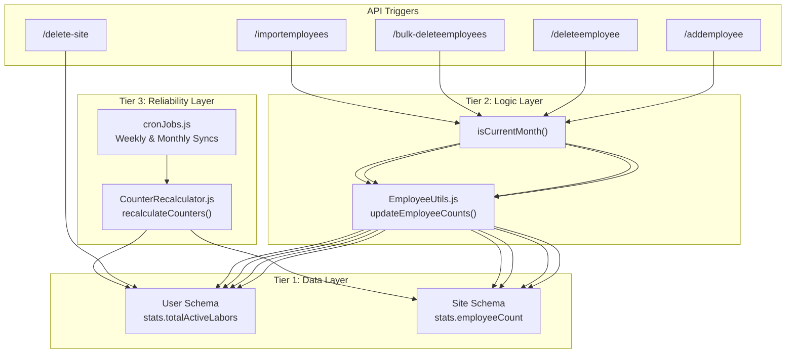
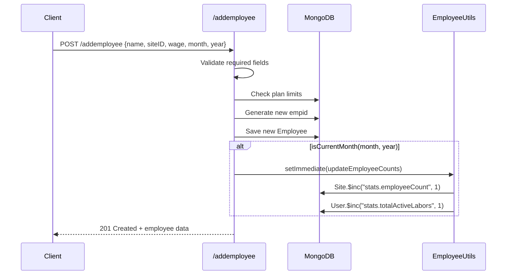
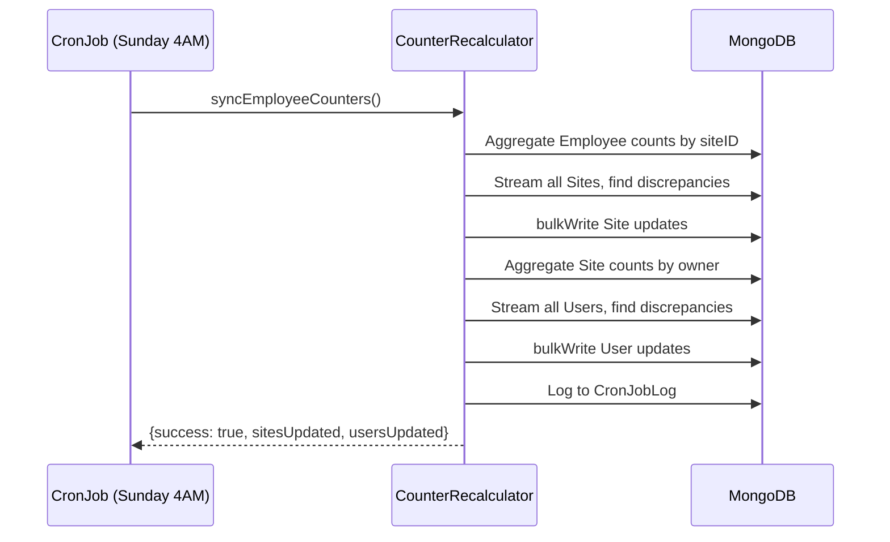

# Current Month Employee Counter - Complete Technical Documentation

> **Report Date:** January 3, 2026  
> **Document Status:** Comprehensive Analysis  
> **Version:** 2.0

---

## Table of Contents

- [1. Executive Summary](#1-executive-summary)
- [2. Architecture Overview](#2-architecture-overview)
- [3. Database Schema Layer](#3-database-schema-layer)
- [4. Core Utility Functions](#4-core-utility-functions)
- [5. API Integration Points](#5-api-integration-points)
- [6. Self-Healing Cron Jobs](#6-self-healing-cron-jobs)
- [7. Data Consumption Endpoints](#7-data-consumption-endpoints)
- [8. System Flow Diagrams](#8-system-flow-diagrams)
- [9. Complete Code Reference](#9-complete-code-reference)
- [10. Summary & Best Practices](#10-summary--best-practices)

---

## 1. Executive Summary

This document provides a **complete, in-depth technical analysis** of the Current Month Employee Counter system implemented in the Finance Dashboard backend. The system tracks the **total number of employees for the current month** across all users and sites, using a highly optimized **Calculate-on-Write** caching strategy.

### Key Goals

1. **Instant Dashboard Load**: Avoid expensive `countDocuments()` queries on every page load
2. **Plan Enforcement**: Allow the system to enforce employee limits per user's subscription plan
3. **Data Integrity**: Ensure counters remain accurate through atomic updates and self-healing mechanisms
4. **Current Month Focus**: Only track employees for the current month (counters reset monthly)

### Affected Files

| File | Purpose |
|------|---------|
| `models/Userschema.js` | Stores `stats.totalActiveLabors` - user-level counter |
| `models/Siteschema.js` | Stores `stats.employeeCount` - site-level counter |
| `Utils/EmployeeUtils.js` | Core `updateEmployeeCounts()` function and `isCurrentMonth()` helper |
| `Utils/CounterRecalculator.js` | Self-healing recalculation logic |
| `Routes/EmployeeDetails.js` | Triggers counter updates on add/delete/import operations |
| `Routes/dashboard.js` | Reads cached counters for dashboard display and site deletion |
| `Routes/usage.js` | Reads cached counters for admin usage dashboards |
| `services/cronJobs.js` | Schedules self-healing sync jobs |

---

## 2. Architecture Overview

The employee counter system operates on a **three-tier architecture**:



### Design Principles

1. **Calculate-on-Write**: Counters are updated at write-time (add/delete), not read-time
2. **Atomic Updates**: Uses MongoDB `$inc` operator to prevent race conditions
3. **Current Month Filtering**: Only updates counters if the affected employee belongs to the current month
4. **Deferred Execution**: Uses `setImmediate()` to avoid blocking the main response
5. **Self-Healing**: Weekly cron job recalculates counters to fix any drift

---

## 3. Database Schema Layer

### 3.1 User Schema (`models/Userschema.js`)

The User schema stores the **aggregate employee count across all active sites** for the user.

**Location:** Lines 162-166

```javascript
// 👇 Cached stats for Calculate-on-Write optimization
// These are updated when employees are added/removed, avoiding expensive aggregations on dashboard
stats: {
  totalActiveLabors: { type: Number, default: 0 }, // Total employees across ALL active sites for current month
},
```

**Key Fields:**

| Field | Type | Default | Description |
|-------|------|---------|-------------|
| `stats.totalActiveLabors` | Number | 0 | Total employees across ALL active sites for the current month |

**Related Fields for Plan Enforcement:**

```javascript
// Business Plan Limits (line 70-81)
businessLimits: {
  maxActiveSites: { type: Number, default: 10 },
  maxTotalEmployees: { type: Number, default: 100 }, // Total employees across ALL active sites
  isWhatsApp: { type: Boolean, default: true },
  isPDF: { type: Boolean, default: true },
  isExcel: { type: Boolean, default: true },
  isSupervisorAccess: { type: Boolean, default: true },
  isChangeTracking: { type: Boolean, default: true },
},
```

---

### 3.2 Site Schema (`models/Siteschema.js`)

The Site schema stores the **per-site employee count** for the current month.

**Location:** Lines 29-33

```javascript
// 👇 Cached stats for Calculate-on-Write optimization
// These are updated when employees are added/removed, avoiding expensive aggregations on dashboard
stats: {
  employeeCount: { type: Number, default: 0 }, // Cached count of current month employees on this site
},
```

**Complete Site Schema:**

```javascript
const siteSchema = new mongoose.Schema(
  {
    sitename: {
      type: String,
      required: true,
      trim: true,
    },
    supervisors: [
      {
        type: mongoose.Schema.Types.ObjectId,
        ref: "Supervisor",
      },
    ],
    isActive: {
      type: Boolean,
      default: true,
    },
    owner: {
      type: mongoose.Schema.Types.ObjectId,
      ref: "User",
      required: true,
    },
    createdBy: {
      type: String, // Email of creator
      required: true,
    },
    // 👇 Cached stats for Calculate-on-Write optimization
    stats: {
      employeeCount: { type: Number, default: 0 },
    },
  },
  {
    timestamps: true,
  }
);
```

---

## 4. Core Utility Functions

### 4.1 EmployeeUtils.js (`Utils/EmployeeUtils.js`)

This is the **central utility module** that handles all counter update operations.

#### 4.1.1 `isCurrentMonth(month, year)`

**Location:** Lines 16-39

**Purpose:** Checks if the given month/year matches the current month/year **in IST timezone**. This ensures counter updates only apply to current month employees.

> [!IMPORTANT]
> **Timezone Trap Prevention**: This function uses IST (India Standard Time, UTC+5:30) instead of server local time. If the server was in UTC but users are in IST, there would be a daily 5.5-hour window where the server's "current month" could differ from the user's month. For example, at 12:30 AM IST on Feb 1st, it's still 7:00 PM UTC on Jan 31st.

```javascript
/**
 * Check if the given month/year matches the current month/year in IST timezone.
 * Used to ensure counter updates only apply to current month employees.
 * 
 * IMPORTANT: Uses IST (India Standard Time, UTC+5:30) to prevent timezone trap:
 * - If server is in UTC, but user is in IST, there's a daily 5.5-hour window
 *   where the server's "current month" could differ from the user's month.
 * - Example: At 12:30 AM IST on Feb 1st, it's still 7:00 PM UTC on Jan 31st.
 * - Without IST normalization, counters would not update correctly in this window.
 * 
 * @param {number} month - Month to check (1-12)
 * @param {number} year - Year to check
 * @returns {boolean} True if it matches the current month in IST
 */
const isCurrentMonth = (month, year) => {
    // Get current time in IST (UTC+5:30)
    const now = new Date();
    const istOffset = 5.5 * 60 * 60 * 1000; // 5 hours 30 minutes in milliseconds
    const istDate = new Date(now.getTime() + now.getTimezoneOffset() * 60 * 1000 + istOffset);
    
    const currentMonth = istDate.getMonth() + 1; // getMonth() is 0-indexed
    const currentYear = istDate.getFullYear();
    return parseInt(month) === currentMonth && parseInt(year) === currentYear;
};
```

**Usage Example:**
```javascript
// Only update counters if adding to current month
if (isCurrentMonth(month, year)) {
  updateEmployeeCounts(siteID, userId, 1);
}
```

---

#### 4.1.2 `updateEmployeeCounts(siteId, userId, change)`

**Location:** Lines 30-70

**Purpose:** Updates employee counters for both Site and User using atomic `$inc` operations. This is the core of the "Calculate on Write" optimization strategy.

```javascript
/**
 * Updates employee counters for both Site and User using atomic $inc operations.
 * This is the core of the "Calculate on Write" optimization strategy.
 * 
 * When to call:
 * - addemployee: change = +1
 * - deleteemployee: change = -1 
 * - bulk-deleteemployees: change = -N (total deleted from that site)
 * - importemployees: change = +N (total successfully imported)
 * - delete-site: called separately, uses the site's cached count
 * 
 * @param {String} siteId - The ID of the site where action happened
 * @param {String} userId - The ID of the site owner
 * @param {Number} change - Positive to add, negative to remove (e.g., 1, -1, -50)
 * @returns {Promise<void>}
 */
const updateEmployeeCounts = async (siteId, userId, change) => {
  if (!change || change === 0) return;
  if (!siteId || !userId) {
    console.warn("⚠️ updateEmployeeCounts called with missing siteId or userId");
    return;
  }

  try {
    // 1. Update the specific Site's cached count (atomic operation)
    await Site.findByIdAndUpdate(siteId, { 
      $inc: { "stats.employeeCount": change } 
    });

    // 2. Update the User's global total (atomic operation)
    await User.findByIdAndUpdate(userId, { 
      $inc: { "stats.totalActiveLabors": change } 
    });

    console.log(`📊 Counter updated: Site ${siteId} & User ${userId} -> ${change > 0 ? '+' : ''}${change}`);
  } catch (error) {
    // Log but don't throw - we don't want counter updates to block the main response
    console.error("⚠️ Counter update failed:", error.message);
    // Consider: Add this to a retry queue or alert monitoring system
  }
};
```

**Key Design Decisions:**

1. **Early Return on Invalid Input**: Returns immediately if `change` is 0 or if IDs are missing
2. **Atomic Operations**: Uses `$inc` operator to ensure thread-safe updates
3. **Non-Blocking Errors**: Catches and logs errors without throwing to avoid disrupting the main operation
4. **Dual Update**: Updates both Site and User in a single function call

---

## 5. API Integration Points

### 5.1 Add Employee (`POST /addemployee`)

**File:** `Routes/EmployeeDetails.js`  
**Location:** Lines 116-364

**Counter Update Logic (Lines 274-280):**

```javascript
// [Calculate-on-Write] Trigger counter update for Site and User
// ONLY update counters if adding to current month (counters track current month employees)
if (isCurrentMonth(month, year)) {
  setImmediate(() => {
    updateEmployeeCounts(siteID.trim(), req.user.id, 1);
  });
}
```

**Complete Flow:**

1. Validate required fields (name, siteID, wage, month, year)
2. Check plan limits (Business plan vs other plans)
3. Generate new employee ID (`EMP001`, `EMP002`, etc.)
4. Create and save the new employee record
5. **If current month → Trigger counter update (+1)**
6. Track the creation with OptimizedChangeTracker
7. Return success response

**Business Plan Limit Check (Lines 168-194):**

```javascript
// Handle Business plan: total employees across ALL user's active sites
if (plan === "business") {
  // Get all active sites owned by this user
  const activeSites = await Site.find({
    owner: req.user.id,
    isActive: true,
  }).select("_id");

  const activeSiteIds = activeSites.map((s) => s._id);

  // Count total employees across all active sites for this month
  const totalEmployeesAcrossSites = await employeeSchema.countDocuments({
    siteID: { $in: activeSiteIds },
    month: month,
    year: year,
  });

  const maxTotalEmployees =
    req.user.businessLimits?.maxTotalEmployees ||
    currentPlanLimits.maxTotalEmployees;

  if (totalEmployeesAcrossSites >= maxTotalEmployees) {
    return res.status(403).json({
      success: false,
      message: `You have reached the maximum limit of ${maxTotalEmployees} total employees across all sites for this month. Please upgrade your plan or contact support to increase your limit.`,
    });
  }
}
```

---

### 5.2 Delete Employee (`DELETE /deleteemployee`)

**File:** `Routes/EmployeeDetails.js`  
**Location:** Lines 366-697

**Counter Update Logic (Lines 600-615):**

```javascript
// [Calculate-on-Write] Trigger counter update for Site and User
// ONLY update counters if deleting from current month
if (deletedEmployees.length > 0 && isCurrentMonth(month, year)) {
  // Group by siteID in case of deletePreviousMonth deleting from multiple sites
  const siteCounts = {};
  deletedEmployees.forEach((emp) => {
    if (!siteCounts[emp.siteID]) {
      siteCounts[emp.siteID] = 0;
    }
    siteCounts[emp.siteID] = 1; // 1 per employee
  });

  Object.entries(siteCounts).forEach(([sID, count]) => {
    setImmediate(() => updateEmployeeCounts(sID, req.user.id, -count));
  });
}
```

**Complete Flow:**

1. Validate required fields (empid, name, month, year)
2. Check if `deletePreviousMonth` flag is set
3. If deleting all records → Delete all employee records across all months
4. If deleting specific month → Delete only that month's record
5. **If current month → Trigger counter update (-1)**
6. Mark future months for recalculation (carry-forward impact)
7. Track the deletion with OptimizedChangeTracker
8. Return success response

---

### 5.3 Bulk Delete Employees (`POST /bulk-deleteemployees`)

**File:** `Routes/EmployeeDetails.js`  
**Location:** Lines 699-860+

**Counter Update Logic:**

The bulk delete endpoint processes each employee ID in the array, deletes the record, and at the end updates counters based on how many employees were actually deleted from the current month.

```javascript
// Similar pattern to single delete:
// After all deletions complete, count deletions per site and call updateEmployeeCounts
```

---

### 5.4 Import Employees (`POST /importemployees`)

**File:** `Routes/EmployeeDetails.js`  
**Location:** Lines 860-1300

**Counter Update Logic (Lines 1220-1233):**

```javascript
// [Calculate-on-Write] Trigger counter update for Site and User
// ONLY update counters if importing to current month
if (
  successfulImports.length > 0 &&
  isCurrentMonth(targetMonth, targetYear)
) {
  setImmediate(() => {
    updateEmployeeCounts(
      siteID.trim(),
      req.user.id,
      successfulImports.length
    );
  });
}
```

**Complete Flow:**

1. Validate source and target month/year
2. Check plan limits before allowing import
3. Fetch source employees from previous month
4. Check for duplicates in target month
5. For each employee:
   - Create new record with carry-forward balance
   - Track the import
6. **If importing to current month → Trigger counter update (+N)**
7. Return summary with success/failure counts

**Plan Limit Check for Import (Lines 943-981):**

```javascript
// Handle Business plan: total employees across ALL user's active sites
if (plan === "business") {
  const activeSites = await Site.find({
    owner: req.user.id,
    isActive: true,
  }).select("_id");

  const activeSiteIds = activeSites.map((s) => s._id);

  // Count total employees across all active sites for target month
  const totalEmployeesAcrossSites = await employeeSchema.countDocuments({
    siteID: { $in: activeSiteIds },
    month: targetMonth,
    year: targetYear,
  });

  const maxTotalEmployees =
    req.user.businessLimits?.maxTotalEmployees ||
    currentPlanLimits.maxTotalEmployees;

  // Check if import would exceed total limit
  const employeesToImport = employeeIds.length || /* count source */;

  if (
    totalEmployeesAcrossSites >= maxTotalEmployees ||
    employeesToImport + totalEmployeesAcrossSites > maxTotalEmployees
  ) {
    return res.status(403).json({
      success: false,
      message: `You have reached the maximum limit of ${maxTotalEmployees} total employees across all sites for this month.`,
    });
  }
}
```

---

### 5.5 Delete Site (`DELETE /delete-site`)

**File:** `Routes/dashboard.js`  
**Location:** Lines 182-261

**Counter Update Logic (Lines 225-249):**

```javascript
// [Calculate-on-Write] Read the cached employee count BEFORE deleting the site
const countToRemove = site.stats?.employeeCount || 0;

// Remove site from database
await Site.findByIdAndDelete(siteId);

// Remove site reference from user's site array
userdata.site = userdata.site.filter((id) => id.toString() !== siteId);
await userdata.save();

// remove all employees associated with this site
await Employee.deleteMany({ siteID: siteId });

// remove all supervisors associated with this site
await Supervisor.deleteMany({ site: siteId });

// [Calculate-on-Write] Update User's Total Count
// We directly update here instead of using updateEmployeeCounts
// because the site is already deleted (no site counter to update)
// ONLY decrement if the site was active (counters only track active sites)
if (countToRemove > 0 && site.isActive) {
  await User.findByIdAndUpdate(user.id, { 
    $inc: { "stats.totalActiveLabors": -countToRemove } 
  });
}
```

**Key Points:**
- Reads the cached `stats.employeeCount` BEFORE deleting the site
- Only decrements the user's counter if the site was active
- Uses direct `$inc` update (not `updateEmployeeCounts`) since the site is being deleted

---

## 6. Self-Healing Cron Jobs

### 6.1 CounterRecalculator.js (`Utils/CounterRecalculator.js`)

This module provides the self-healing mechanism that corrects any drift between cached counters and actual data.

#### 6.1.1 `recalculateCounters(jobName)`

**Location:** Lines 19-151

**Purpose:** Recalculates all cached employee counters for Sites and Users using a "Chained" algorithm.

**Algorithm:**
1. **Step 1 - Fix Sites**: Aggregate real Employee data → Update Site counters
2. **Step 2 - Fix Users**: Aggregate corrected Site data → Update User counters

```javascript
/**
 * Recalculates all cached employee counters for Sites and Users.
 * Uses cursor-based streaming and bulkWrite for efficiency.
 * 
 * @param {string} jobName - Optional job name for logging (default: 'weekly-counter-sync')
 * @returns {Promise<{success: boolean, sitesUpdated: number, usersUpdated: number}>}
 */
const recalculateCounters = async (jobName = 'weekly-counter-sync') => {
    console.time('⏱️ CounterRecalculation');
    const now = new Date();
    const currentMonth = now.getMonth() + 1;
    const currentYear = now.getFullYear();
    let sitesUpdated = 0;
    let usersUpdated = 0;

    try {
        // ==========================================
        // STEP 1: FIX SITES (Source of Truth: Employees)
        // ==========================================
        
        // A. Get the Real Counts from Employees for current month
        const employeeCounts = await Employee.aggregate([
            { $match: { month: currentMonth, year: currentYear } },
            { $group: { _id: "$siteID", count: { $sum: 1 } } }
        ]);
        
        // Convert array to Map for O(1) lookup: { "siteId_string": 5 }
        const empCountMap = new Map(employeeCounts.map(e => [String(e._id), e.count]));

        // B. Stream ALL Sites to find discrepancies
        // .cursor() automatically batches data, keeping memory low
        const siteCursor = Site.find({}).cursor(); 
        let siteOps = [];

        for await (const site of siteCursor) {
            const realCount = empCountMap.get(String(site._id)) || 0;
            const cachedCount = site.stats?.employeeCount || 0;

            if (realCount !== cachedCount) {
                siteOps.push({
                    updateOne: {
                        filter: { _id: site._id },
                        update: { $set: { "stats.employeeCount": realCount } }
                    }
                });
                sitesUpdated++;
            }

            // Flush batch if too big (e.g., 500 ops)
            if (siteOps.length >= 500) {
                await Site.bulkWrite(siteOps);
                siteOps = [];
            }
        }
        // Flush remaining ops
        if (siteOps.length > 0) await Site.bulkWrite(siteOps);

        // ==========================================
        // STEP 2: FIX USERS (Source of Truth: Sites)
        // ==========================================

        // A. Get Real Counts from Sites (We just fixed them!)
        // Only count Active sites for user totals
        const siteAgg = await Site.aggregate([
             { $match: { isActive: true } }, 
             { $group: { _id: "$owner", total: { $sum: "$stats.employeeCount" } } }
        ]);
        
        const userCountMap = new Map(siteAgg.map(u => [String(u._id), u.total]));

        // B. Stream ALL Users
        const userCursor = User.find({}).cursor();
        let userOps = [];

        for await (const user of userCursor) {
            const realTotal = userCountMap.get(String(user._id)) || 0;
            const cachedTotal = user.stats?.totalActiveLabors || 0;

            if (realTotal !== cachedTotal) {
                userOps.push({
                    updateOne: {
                        filter: { _id: user._id },
                        update: { $set: { "stats.totalActiveLabors": realTotal } }
                    }
                });
                usersUpdated++;
            }

            // Flush batch if too big
            if (userOps.length >= 500) {
                await User.bulkWrite(userOps);
                userOps = [];
            }
        }
        // Flush remaining ops
        if (userOps.length > 0) await User.bulkWrite(userOps);

        // ==========================================
        // STEP 3: LOGGING (Minimalist)
        // ==========================================
        
        console.timeEnd('⏱️ CounterRecalculation');
        console.log(`✅ Counter Sync Complete. Fixed ${sitesUpdated} Sites, ${usersUpdated} Users.`);
        
        // Log to existing CronJobLog collection
        await CronJobLog.create({
            jobName: jobName,
            executionDate: now,
            status: 'completed',
            metadata: {
                month: currentMonth,
                year: currentYear,
                sitesDriftFixed: sitesUpdated,
                usersDriftFixed: usersUpdated
            }
        });

        return { success: true, sitesUpdated, usersUpdated };

    } catch (error) {
        console.error("❌ Counter Sync Failed:", error.message);
        
        // Log failure
        await CronJobLog.create({
            jobName: jobName,
            executionDate: now,
            status: 'failed',
            failures: [{ error: error.message, timestamp: new Date() }]
        });

        return { success: false, error: error.message };
    }
};
```

#### 6.1.2 `monthlyCounterReset()`

**Location:** Lines 153-161

**Purpose:** Runs on the 1st of each month to recalculate counters for the new month (which will be 0 or near-0 since users haven't imported employees yet).

```javascript
/**
 * Monthly counter reset - runs on 1st of each month at midnight.
 * Recalculates all counters for the new month (which will be 0 or near-0
 * since users haven't imported employees for the new month yet).
 */
const monthlyCounterReset = async () => {
    console.log('🗓️ Monthly Counter Reset: New month started, recalculating counters...');
    return await recalculateCounters('monthly-counter-reset');
};
```

---

### 6.2 Cron Job Scheduling (`services/cronJobs.js`)

**Location:** Lines 138-144

```javascript
// Employee Counter Sync: Sunday at 4 AM IST (Self-healing for Calculate-on-Write)
// Fixes any drift in cached Site.stats.employeeCount and User.stats.totalActiveLabors
this.scheduleJob('weekly-counter-sync', '0 4 * * 0', this.syncEmployeeCounters.bind(this));

// Monthly Counter Reset: 1st day of every month at 12:00 AM (midnight)
// Resets counters for the new month since employees need to be re-imported
this.scheduleJob('monthly-counter-reset', '0 0 1 * *', this.monthlyCounterReset.bind(this));
```

**Cron Job Schedule:**

| Job Name | Cron Expression | Schedule | Purpose |
|----------|----------------|----------|---------|
| `weekly-counter-sync` | `0 4 * * 0` | Sunday 4:00 AM | Fix drift from partial failures |
| `monthly-counter-reset` | `0 0 1 * *` | 1st of month, midnight | Reset counters for new month |

#### 6.2.1 `syncEmployeeCounters()`

**Location:** Lines 1656-1671

```javascript
/**
 * Sync employee counters for Sites and Users.
 * Fixes any drift in cached values using chained algorithm.
 * Schedule: Sundays at 4 AM IST
 */
async syncEmployeeCounters() {
    console.log('🔄 Running weekly employee counter sync...');
    
    try {
        const result = await recalculateCounters();
        
        if (result.success) {
            console.log(`✅ Counter sync complete. Fixed ${result.sitesUpdated} Sites, ${result.usersUpdated} Users.`);
        } else {
            console.error('❌ Counter sync failed:', result.error);
        }
    } catch (error) {
        console.error('❌ Error in counter sync:', error.message);
        throw error;
    }
}
```

#### 6.2.2 Manual Trigger Functions

**Location:** Lines 1673-1704

```javascript
// Manual trigger for counter sync
async manualTriggerCounterSync() {
    console.log('🔧 Manual trigger: Employee Counter Sync');
    await this.syncEmployeeCounters();
}

/**
 * Monthly counter reset - runs on 1st of each month at midnight.
 * Resets counters for the new month.
 */
async monthlyCounterReset() {
    console.log('🗓️ Running monthly counter reset...');
    
    try {
        const result = await monthlyCounterReset();
        
        if (result.success) {
            console.log(`✅ Monthly reset complete. Reset ${result.sitesUpdated} Sites, ${result.usersUpdated} Users.`);
        } else {
            console.error('❌ Monthly reset failed:', result.error);
        }
    } catch (error) {
        console.error('❌ Error in monthly counter reset:', error.message);
        throw error;
    }
}

// Manual trigger for monthly counter reset
async manualTriggerMonthlyReset() {
    console.log('🔧 Manual trigger: Monthly Counter Reset');
    await this.monthlyCounterReset();
}
```

---

## 7. Data Consumption Endpoints

### 7.1 Dashboard Home (`GET /v2/home`)

**File:** `Routes/dashboard.js`  
**Location:** Lines 40-100

```javascript
// NEW, SEPARATE ENDPOINT FOR THE MODERN DASHBOARD
// [Calculate-on-Write] OPTIMIZED: Now uses cached counters instead of expensive aggregation
router.get("/v2/home", authenticateAndTrack, async (req, res) => {
  try {
    const user = req.user;
    if (!user) {
      return res
        .status(401)
        .json({ success: false, message: "Authentication required." });
    }

    // 1. Fetch the user (with stats) and their site details (with stats) in one go.
    // [Calculate-on-Write] We now select 'stats' fields which are pre-calculated
    const userdata = await User.findById(user.id)
      .select("name role site stats") // Include user stats
      .populate({
        path: "site",
        select: "sitename createdAt isActive stats", // Include site stats with cached employeeCount
      });

    if (!userdata) {
      return res
        .status(404)
        .json({ success: false, message: "User not found." });
    }

    // 2. [Calculate-on-Write] NO MORE AGGREGATION NEEDED!
    // Employee counts are now cached in site.stats.employeeCount
    // This reduces database load from O(N) aggregation to O(1) reads

    // 3. Prepare the clean 'sites' array reading counts directly from cache
    const sitesWithCounts = userdata.site.map((site) => ({
      _id: site._id,
      sitename: site.sitename,
      createdAt: site.createdAt,
      isActive: site.isActive,
      // READ DIRECTLY FROM CACHE - no more aggregation!
      employeeCount: site.stats?.employeeCount || 0,
    }));

    // 4. Construct the final, clean payload.
    // [Calculate-on-Write] Total employees read directly from user stats cache
    const responsePayload = {
      userName: userdata.name,
      userRole: userdata.role,
      sites: sitesWithCounts,
      summary: {
        totalSites: userdata.site.length,
        // READ DIRECTLY FROM CACHE - no more aggregation!
        totalEmployees: userdata.stats?.totalActiveLabors || 0,
      },
    };

    res.status(200).json({ success: true, data: responsePayload });
  } catch (error) {
    console.error("Error in /v2/home route:", error);
    res
      .status(500)
      .json({ success: false, message: "An internal server error occurred." });
  }
});
```

**Performance Improvement:**
- **Before**: `O(N)` aggregation query scanning all employees
- **After**: `O(1)` direct read from cached `stats` field

---

### 7.2 Usage Dashboard (`GET /api/usage/dashboard`)

**File:** `Routes/usage.js`  
**Location:** Lines 175-234

The admin usage dashboard also reads cached counters:

```javascript
// [Optimized] Read directly from Calculate-on-Write cache
totalLaborers = foundUser.stats?.totalActiveLabors || 0;
totalSites = foundUser.site ? foundUser.site.length : 0;

// Map specific site counts if available
if (foundUser.site && foundUser.site.length > 0) {
  sites = foundUser.site.map(s => ({
    sitename: s.sitename,
    count: s.stats?.employeeCount || 0, // [Optimized] Cached site count
    isActive: s.isActive
  }));
}
```

---

### 7.3 Employee List Endpoints

**File:** `Routes/EmployeeDetails.js`  
**Location:** Lines 2288-2364

Both `/allemployeelist` and `/allemployeelistmobile` endpoints return the cached counter:

```javascript
return res.status(200).json({
  success: true,
  data: employeeList,
  currentTotalEmployees: req.user.stats?.totalEmployees || 0, // Total employees across ALL sites
  message: `Fetched employee list for ${month}/${year} at site ${siteID}`,
});
```

---

## 8. System Flow Diagrams

### 8.1 Add Employee Flow



### 8.2 Weekly Sync Flow



---

## 9. Complete Code Reference

### 9.1 File: `Utils/EmployeeUtils.js` (Complete)

```javascript
/**
 * Employee Utilities Module
 *
 * This module contains utility functions for employee management.
 *
 * Functions:
 * - latestEmpSerialNumber: Used for generating new employee IDs
 * - pendingAttendance: Get employees with pending attendance
 * - updateEmployeeCounts: Calculate-on-Write counter updates for Site and User
 */

const EmployeeSchema = require("../models/EmployeeSchema");
const User = require("../models/Userschema");
const Site = require("../models/Siteschema");

/**
 * Check if the given month/year matches the current month/year.
 * Used to ensure counter updates only apply to current month employees.
 * @param {number} month - Month to check (1-12)
 * @param {number} year - Year to check
 * @returns {boolean} True if it's the current month
 */
const isCurrentMonth = (month, year) => {
    const now = new Date();
    const currentMonth = now.getMonth() + 1; // getMonth() is 0-indexed
    const currentYear = now.getFullYear();
    return parseInt(month) === currentMonth && parseInt(year) === currentYear;
};

/**
 * Updates employee counters for both Site and User using atomic $inc operations.
 * This is the core of the "Calculate on Write" optimization strategy.
 * 
 * When to call:
 * - addemployee: change = +1
 * - deleteemployee: change = -1 
 * - bulk-deleteemployees: change = -N (total deleted from that site)
 * - importemployees: change = +N (total successfully imported)
 * - delete-site: called separately, uses the site's cached count
 * 
 * @param {String} siteId - The ID of the site where action happened
 * @param {String} userId - The ID of the site owner
 * @param {Number} change - Positive to add, negative to remove (e.g., 1, -1, -50)
 * @returns {Promise<void>}
 */
const updateEmployeeCounts = async (siteId, userId, change) => {
  if (!change || change === 0) return;
  if (!siteId || !userId) {
    console.warn("⚠️ updateEmployeeCounts called with missing siteId or userId");
    return;
  }

  try {
    // 1. Update the specific Site's cached count (atomic operation)
    await Site.findByIdAndUpdate(siteId, { 
      $inc: { "stats.employeeCount": change } 
    });

    // 2. Update the User's global total (atomic operation)
    await User.findByIdAndUpdate(userId, { 
      $inc: { "stats.totalActiveLabors": change } 
    });

    console.log(`📊 Counter updated: Site ${siteId} & User ${userId} -> ${change > 0 ? '+' : ''}${change}`);
  } catch (error) {
    // Log but don't throw - we don't want counter updates to block the main response
    console.error("⚠️ Counter update failed:", error.message);
    // Consider: Add this to a retry queue or alert monitoring system
  }
};

module.exports = {
  latestEmpSerialNumber,
  pendingAttendance,
  updateEmployeeCounts,
  isCurrentMonth,
};
```

---

## 10. Summary & Best Practices

### 10.1 System Capabilities

| Feature | Implementation | Benefit |
|---------|----------------|---------|
| **Performance** | Cached counters (`stats` field) | O(1) read on dashboard load |
| **Accuracy** | Atomic `$inc` updates | No race conditions |
| **Integrity** | Weekly self-healing cron job | Auto-corrects any drift |
| **Scope** | `isCurrentMonth()` filtering | Historical edits don't break live stats |
| **Scalability** | Cursor-based streaming in recalculator | Low memory usage |
| **Resilience** | Non-blocking error handling | Counter failures don't break main operations |

### 10.2 Best Practices for Future Development

1. **Always use `isCurrentMonth()` before calling `updateEmployeeCounts()`**
2. **Use `setImmediate()` to defer counter updates** - keeps main response fast
3. **Never skip the counter update** when adding/deleting current month employees
4. **Use atomic `$inc`** - never read-then-write patterns
5. **Log counter failures** but don't throw - let the weekly cron fix drift
6. **For site deletions**, read the cached count BEFORE deleting the site

### 10.3 Affected Counters Summary

| Counter | Location | Updated By | Read By |
|---------|----------|------------|---------|
| `Site.stats.employeeCount` | Siteschema.js | updateEmployeeCounts() | /v2/home, /usage/dashboard |
| `User.stats.totalActiveLabors` | Userschema.js | updateEmployeeCounts(), delete-site | /v2/home, /usage/dashboard, /allemployeelist |

---

## Appendix: Version History

| Version | Date | Author | Changes |
|---------|------|--------|---------|
| 1.0 | - | - | Initial documentation |
| 2.0 | Jan 3, 2026 | System Analysis | Complete rewrite with all code, nested functions, full flow analysis |
