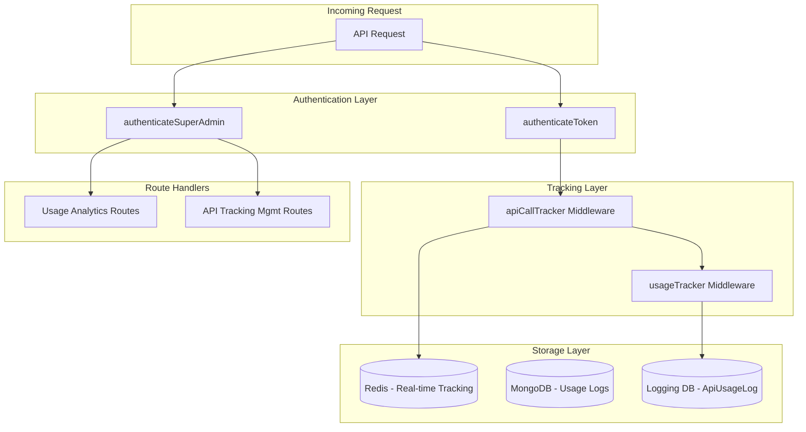
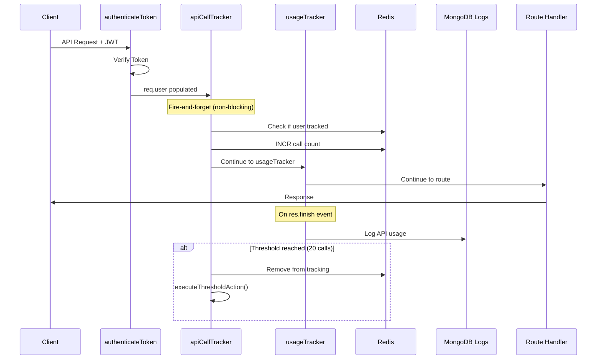
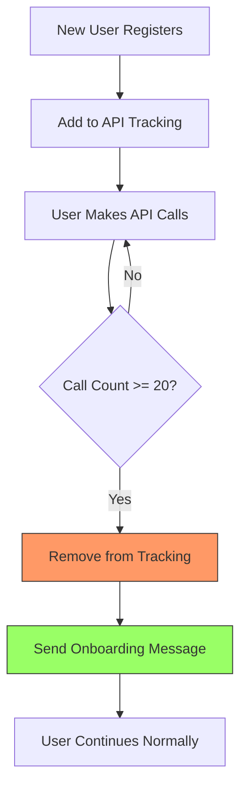

# API Tracking & Usage Routes - Complete Guide

This documentation provides a comprehensive reference for the **API Tracking** and **Usage Analytics** system in the backend. It covers every route, middleware, model, and helper function involved in tracking API calls, monitoring user activity, and managing usage analytics.

---

## Table of Contents

1. [System Architecture Overview](#system-architecture-overview)
2. [Usage Routes (`Routes/usage.js`)](#usage-routes)
3. [API Tracking Management Routes (`Routes/apiTrackingManagement.js`)](#api-tracking-management-routes)
4. [Middleware Components](#middleware-components)
5. [Models Reference](#models-reference)
6. [Configuration Files](#configuration-files)
7. [Flow Diagrams](#flow-diagrams)
8. [Quick Reference](#quick-reference)

---

## System Architecture Overview

The API tracking system consists of three main layers:



### Key Components

| Component | Purpose | Storage |
|-----------|---------|---------|
| `usageTracker.js` | Logs every API call with details | MongoDB (logging DB) |
| `apiCallTracker.js` | Tracks specific users for threshold actions | Redis |
| `usage.js` | Dashboard, analytics, and cron job monitoring | Read from MongoDB |
| `apiTrackingManagement.js` | Add/remove users from tracking | Redis management |

---

## Usage Routes

**File**: [Routes/usage.js](file:///c:/Users/SHASHI%20KANT/CODE/Github/FinanceDashbord/Backend/Routes/usage.js)

All routes require **Super Admin authentication** via `authenticateSuperAdmin` middleware.

### Helper Function: `getDateRange()`

Calculates date ranges for filtering logs.

```javascript
getDateRange(period, customStartDate?, customEndDate?)
```

**Parameters**:
- `period`: `'today'` | `'yesterday'` | `'week'` | `'month'` | `'3months'`
- `customStartDate`: Optional YYYY-MM-DD format
- `customEndDate`: Optional YYYY-MM-DD format

**Returns**: `{ startDate: Date, endDate: Date }`

---

### Dashboard Analytics

#### `GET /api/usage/dashboard`

Main dashboard endpoint with comprehensive usage statistics.

**Query Parameters**:
| Parameter | Type | Default | Description |
|-----------|------|---------|-------------|
| `period` | string | `'week'` | Predefined period filter |
| `startDate` | string | null | Custom start date (YYYY-MM-DD) |
| `endDate` | string | null | Custom end date (YYYY-MM-DD) |

**Response Structure**:
```json
{
  "success": true,
  "period": { "type": "week", "startDate": "...", "endDate": "..." },
  "summary": {
    "totalRequests": 1500,
    "totalDataBytes": 2500000,
    "uniqueUsers": 45,
    "uniqueEndpoints": 32,
    "avgRequestsPerUser": 33,
    "totalUsersInResponse": 45
  },
  "users": [
    {
      "phone": "+919876543210",
      "name": "User Name",
      "plan": "pro",
      "isTrial": false,
      "acquisition": { "source": "facebook", "campaign": "..." },
      "totalSites": 3,
      "totalLaborers": 45,
      "sites": [
        { "sitename": "Site A", "count": 15, "isActive": true },
        { "sitename": "Site B", "count": 20, "isActive": true }
      ],
      "totalRequests": 250,
      "totalDataBytes": 500000,
      "endpointCount": 15,
      "activeDays": 7
    }
  ],
  "hourlyDistribution": [{ "hour": 10, "requests": 150 }],
  "dailyActiveUsers": [{ "date": "2025-12-23", "activeUsers": 20 }]
}
```

**Models Used**:
- [ApiUsageLog](file:///c:/Users/SHASHI%20KANT/CODE/Github/FinanceDashbord/Backend/models/ApiUsageLog.js) - Main usage log queries
- [User](file:///c:/Users/SHASHI%20KANT/CODE/Github/FinanceDashbord/Backend/models/Userschema.js) - User details lookup

**Aggregation Pipeline**:
1. Match by timestamp range
2. Group by `userPhone` for totals
3. Calculate `activeDays` using `$addToSet` on date strings
4. Lookup user details from `User` collection
5. Calculate hourly distribution and daily active users

---

#### `GET /api/usage/user-endpoint-analytics`

Detailed endpoint access patterns per user.

**Query Parameters**: Same as `/dashboard`

**Response Structure**:
```json
{
  "success": true,
  "period": { "type": "week", "startDate": "...", "endDate": "...", "totalDays": 7 },
  "summary": {
    "totalUsers": 45,
    "totalRequests": 1500,
    "uniqueEndpoints": 32,
    "avgRequestsPerUser": 33,
    "avgRequestsPerDay": 214
  },
  "users": [
    {
      "phone": "+919876543210",
      "name": "User Name",
      "email": "user@example.com",
      "plan": "pro",
      "isTrial": false,
      "totalRequests": 250,
      "totalDataBytes": 500000,
      "uniqueEndpoints": 15,
      "firstActivity": "2025-12-17T...",
      "lastActivity": "2025-12-23T...",
      "endpoints": [
        {
          "endpoint": "/api/employees",
          "method": "GET",
          "requestCount": 50,
          "totalDataBytes": 100000,
          "avgResponseSize": 2000,
          "firstAccess": "...",
          "lastAccess": "...",
          "successRate": 98.5,
          "recentTimestamps": ["..."]
        }
      ]
    }
  ]
}
```

---

#### `GET /api/usage/new-users`

Track new users based on their first API usage.

> [!NOTE]
> A user is "new" in a period if they have NO logs before that period's start date.

**Query Parameters**: Same as `/dashboard`

**Response Highlights**:
- `newUsersCount`: Total new users in period
- `growthRate`: Percentage growth compared to existing users
- `avgNewUsersPerDay`: Average new users per day
- `newUsers`: List of new users with **stats** (`totalLaborers`, `siteCount`, `sites`)
- `dailyBreakdown`: New users grouped by date

**Response Example**:
```json
{
  "success": true,
  "summary": {
    "newUsersCount": 5,
    "growthRate": 2.5,
    "avgNewUsersPerDay": 0.71
  },
  "newUsers": [
    {
      "phone": "+919876543210",
      "name": "New User",
      "totalLaborers": 12,
      "siteCount": 2,
      "sites": [
        { "sitename": "Site X", "count": 12, "isActive": true }
      ],
      "firstApiUsage": "..."
    }
  ]
}
```

**Optimizations Applied**:
- Single aggregation pipeline instead of multiple queries
- Uses `$cond` to calculate `requestsInPeriod` without extra queries

---

#### `GET /api/usage/user-activity/:phone`

Detailed activity tracker for a specific user.

**URL Parameters**:
| Parameter | Description |
|-----------|-------------|
| `phone` | User's phone number |

**Query Parameters**:
| Parameter | Type | Default |
|-----------|------|---------|
| `period` | string | `'week'` |

**Response Structure**:
```json
{
  "success": true,
  "period": { "type": "week", "startDate": "...", "endDate": "..." },
  "user": {
    "name": "User Name",
    "phone": "+919876543210",
    "email": "...",
    "plan": "pro",
    "isTrial": false,
    "registeredAt": "...",
    "planActivatedAt": "..."
  },
  "summary": {
    "totalRequests": 250,
    "totalDataBytes": 500000,
    "uniqueEndpoints": 15,
    "firstRequest": "...",
    "lastRequest": "...",
    "avgRequestsPerDay": "35.71"
  },
  "endpointBreakdown": [...],
  "dailyActivity": [...],
  "recentActivity": [/* Last 2000 requests */]
}
```

---

#### `GET /api/usage/system-performance`

Overall system performance metrics.

**Response Metrics**:
- Total requests
- Average response size
- Active users and endpoints
- **Status Distribution**: success, clientError, serverError counts and rates
- **Hourly Load**: Requests per hour with average response size
- **Slowest Endpoints**: Top 10 endpoints by average response size

---

### Cron Job Monitoring

#### `GET /api/usage/cron-jobs`

List all recent cron job executions.

**Query Parameters**:
| Parameter | Type | Default | Description |
|-----------|------|---------|-------------|
| `limit` | number | 50 | Number of executions to return |
| `jobType` | string | null | Filter by job type |

**Available Job Types**:
| Job Type | Schedule | Coverage |
|----------|----------|----------|
| `monthly` | 1st of month @ 2 AM | Previous month data |
| `weekly-week1` | 8th of month @ 2 AM | Days 1-7 |
| `weekly-week2` | 15th of month @ 2 AM | Days 8-14 |
| `weekly-week3` | 22nd of month @ 2 AM | Days 15-21 |
| `weekly-week4` | 29th of month @ 2 AM | Days 22-28 |
| `weekly-feb28` | 28th Feb @ 2 AM | February backup |

**Models Used**:
- [CronJobLog](file:///c:/Users/SHASHI%20KANT/CODE/Github/FinanceDashbord/Backend/models/CronJobLogSchema.js)

---

#### `GET /api/usage/cron-jobs/:id`

Get detailed information about a specific cron job execution.

**URL Parameters**: `id` - CronJobLog document ID

**Response Includes**:
- Complete job details (status, counts, execution time)
- `userSummary`: Per-user breakdown
- `successfulReports`: Details of each successful report
- `skippedReports`: Details with skip reasons
- `failures`: Details with error messages
- All reports enriched with user details from User collection

---

#### `GET /api/usage/cron-jobs/user/:phone`

All cron job reports for a specific user.

**URL Parameters**: `phone` - User's phone number

**Response Structure**:
```json
{
  "success": true,
  "period": { ... },
  "user": { /* Full user details */ },
  "summary": {
    "totalCronJobs": 10,
    "totalReports": 50,
    "totalSuccessful": 45,
    "totalSkipped": 3,
    "totalFailed": 2,
    "successRate": "95.74"
  },
  "reports": [/* Per-job breakdown */]
}
```

---

### Maintenance Endpoints

#### `POST /api/usage/cleanup`

Clean up old usage logs.

**Request Body**:
```json
{ "daysToKeep": 90 }
```

**Response**: Deletion count and cutoff date

---

#### `GET /api/usage/health`

Check logging database connection health.

**Response**:
```json
{
  "success": true,
  "data": {
    "loggingDatabase": {
      "connected": true,
      "database": "LoggingDB",
      "collection": "Sitehaazrilogs",
      "modelAvailable": true,
      "documentCount": 150000
    }
  }
}
```

---

#### `GET /api/usage/site-labour-stats`

Aggregate labour data by site for a specific month/year.

**Query Parameters**:
| Parameter | Type | Description |
|-----------|------|-------------|
| `month` | number | Month (1-12), defaults to current |
| `year` | number | Year, defaults to current |

**Aggregation Pipeline**:
1. Match Employee documents by month/year
2. Group by `siteID` with labour count
3. Lookup Site details (sitename, owner)
4. Lookup User/Owner details (name, phone, plan)
5. Project clean output sorted by employee count

**Models Used**:
- [Employee](file:///c:/Users/SHASHI%20KANT/CODE/Github/FinanceDashbord/Backend/models/EmployeeSchema.js)
- [Site](file:///c:/Users/SHASHI%20KANT/CODE/Github/FinanceDashbord/Backend/models/Siteschema.js)
- [User](file:///c:/Users/SHASHI%20KANT/CODE/Github/FinanceDashbord/Backend/models/Userschema.js)

---

### Legacy Endpoints

#### `GET /api/usage/my-stats`

Get current user's own usage statistics.

**Requires**: Regular user authentication via `authenticateAndTrack`

**Response**: User's usage statistics (total requests, data transferred, unique endpoints)

---

## API Tracking Management Routes

**File**: [Routes/apiTrackingManagement.js](file:///c:/Users/SHASHI%20KANT/CODE/Github/FinanceDashbord/Backend/Routes/apiTrackingManagement.js)

These routes manage the Redis-based API call tracking system used for onboarding triggers.

### `POST /api/super-admin/api-tracking/add`

Add a user to API tracking.

**Request Body**:
```json
{ "phoneNumber": "+919876543210" }
```

**What it does**:
1. Adds user to Redis sorted set with expiry timestamp (10 days)
2. Initializes call counter to 0
3. When user makes 20 API calls, triggers onboarding action

**Functions Used**:
- `addUserToTracking(phoneNumber)` from [apiCallTracker.js](file:///c:/Users/SHASHI%20KANT/CODE/Github/FinanceDashbord/Backend/Middleware/apiCallTracker.js)

---

### `POST /api/super-admin/api-tracking/remove`

Remove a user from API tracking.

**Request Body**:
```json
{ "phoneNumber": "+919876543210" }
```

**Functions Used**:
- `removeUserFromTracking(phoneNumber)`

---

### `GET /api/super-admin/api-tracking/status/:phoneNumber`

Get tracking status and call count for a user.

**Response**:
```json
{
  "success": true,
  "data": {
    "phoneNumber": "+919876543210",
    "isBeingTracked": true,
    "apiCallCount": 15,
    "threshold": 20,
    "status": "tracking"
  }
}
```

**Functions Used**:
- `isUserBeingTracked(phoneNumber)`
- `getUserCallCount(phoneNumber)`

---

### `GET /api/super-admin/api-tracking/list`

List all users being tracked.

**Response**:
```json
{
  "success": true,
  "data": {
    "totalUsers": 25,
    "users": [
      {
        "phoneNumber": "+919876543210",
        "callCount": 15,
        "expiresAt": "2025-01-03T...",
        "daysRemaining": 8
      }
    ],
    "threshold": 20
  }
}
```

**Data Source**: Redis sorted set `api:track:users`

---

### `POST /api/super-admin/api-tracking/bulk-add`

Add multiple users to tracking at once.

**Request Body**:
```json
{
  "phoneNumbers": ["+919876543210", "+919876543211", ...]
}
```

**Response**:
```json
{
  "success": true,
  "message": "Added 5/6 users to tracking",
  "data": {
    "success": [...],
    "failed": [...]
  }
}
```

---

## Middleware Components

### Usage Tracker Middleware

**File**: [Middleware/usageTracker.js](file:///c:/Users/SHASHI%20KANT/CODE/Github/FinanceDashbord/Backend/Middleware/usageTracker.js)

#### `usageTracker(req, res, next)`

Main middleware that logs every API call to MongoDB.

**Skip Endpoints**:
- `/api/usage/dashboard`
- `/api/usage/stats`
- `/api/health`
- `/favicon.ico`
- `/robots.txt`

**What it tracks**:
- `mainUserId`: Account owner ID (for billing)
- `userPhone`, `userName`, `userPlan`
- `actor`: Who made the request (User or Supervisor)
- `endpoint`, `method`, `status`
- `responseSizeBytes`, `timestamp`

**How it captures response size**:
- Overrides `res.json()` and `res.send()` to capture response data
- Uses `res.on('finish')` event to trigger logging

---

#### `authenticateAndTrack(req, res, next)`

Combined middleware that chains:
1. `authenticateToken` - JWT verification
2. `apiCallTracker` - Redis-based call counting
3. `usageTracker` - MongoDB logging

```javascript
// Usage in routes
router.get('/protected-route', authenticateAndTrack, handler);
```

---

#### `getUserUsageStats(userId, days)`

Get usage statistics for a specific user.

**Parameters**:
- `userId`: User's MongoDB ObjectId
- `days`: Number of days to look back (default: 30)

**Returns**: Aggregated stats object

---

### API Call Tracker Middleware

**File**: [Middleware/apiCallTracker.js](file:///c:/Users/SHASHI%20KANT/CODE/Github/FinanceDashbord/Backend/Middleware/apiCallTracker.js)

This middleware handles Redis-based tracking for triggering onboarding actions.

#### Configuration Constants

```javascript
const TRACKING_EXPIRY_DAYS = 10;
const API_CALL_THRESHOLD = 20;
const TRACKING_SET_KEY = 'api:track:users';      // Sorted set
const CALL_COUNT_KEY_PREFIX = 'api:calls:';       // Counter keys
```

---

#### Core Functions

##### `addUserToTracking(phoneNumber)`

Adds a user to tracking with 10-day expiry.

**Redis Operations**:
```javascript
// Add to sorted set with expiry timestamp as score
await redisClient.zAdd('api:track:users', { score: expiryTimestamp, value: phoneNumber });
// Initialize counter
await redisClient.setEx('api:calls:+919876543210', 864000, '0');
```

---

##### `removeUserFromTracking(phoneNumber)`

Atomically removes user from tracking.

**Redis Operations**:
```javascript
await redisClient.zRem('api:track:users', phoneNumber);
await redisClient.del('api:calls:+919876543210');
```

---

##### `isUserBeingTracked(phoneNumber)`

Checks if user is in tracking list and not expired.

---

##### `getUserCallCount(phoneNumber)`

Gets current call count from Redis.

---

##### `apiCallTracker(req, res, next)` - Middleware

**Non-blocking** middleware that:
1. Checks if `req.user.phoneNumber` is being tracked
2. Increments call counter atomically via `INCR`
3. On reaching threshold (20 calls):
   - Removes user from tracking immediately (prevents duplicates)
   - Triggers `executeThresholdAction()` (fire-and-forget)

**Race Condition Handling**:
- Uses `zRem` atomic operation
- Returns `0` if already removed by another request
- Only the first request to remove triggers the action

---

##### `executeThresholdAction(phoneNumber, callCount, userInfo)`

Fires when user hits 20 API calls.

**Current Action**:
- Sends WhatsApp onboarding template message
- Uses `sendOnboardingTemplate()` from [whatsappTemplates.js](file:///c:/Users/SHASHI%20KANT/CODE/Github/FinanceDashbord/Backend/Utils/whatsappTemplates.js)

---

##### `cleanupExpiredUsers()`

Should be called by cron job to remove expired entries.

```javascript
await redisClient.zRemRangeByScore('api:track:users', 0, Date.now());
```

---

### Super Admin Auth Middleware

**File**: [Middleware/superAdminAuth.js](file:///c:/Users/SHASHI%20KANT/CODE/Github/FinanceDashbord/Backend/Middleware/superAdminAuth.js)

Separate authentication system for admin panels.

**Environment Variables Required**:
- `SUPER_ADMIN_USERNAME`
- `SUPER_ADMIN_PASSWORD_HASH` (bcrypt hash)
- `SUPER_ADMIN_JWT_SECRET`

#### `authenticateSuperAdmin(req, res, next)`

Verifies JWT token with role `SUPER_ADMIN`.

**Token Expiry**: 24 hours

---

## Models Reference

### ApiUsageLog

**File**: [models/ApiUsageLog.js](file:///c:/Users/SHASHI%20KANT/CODE/Github/FinanceDashbord/Backend/models/ApiUsageLog.js)

**Collection**: `Sitehaazrilogs` (in logging database)

```javascript
{
  mainUserId: ObjectId,           // Account owner (indexed)
  userName: String,               // Denormalized for reporting
  userPhone: String,              // Required
  userPlan: String,               // Default: 'free'
  
  actor: {
    id: String,
    role: 'User' | 'Supervisor'
  },
  
  supervisor: {                   // Optional
    id: ObjectId,
    profileName: String
  },
  
  endpoint: String,
  method: String,
  status: Number,
  responseSizeBytes: Number,
  timestamp: Date                 // expires: '90d' (auto-delete)
}
```

**Indexes**:
- `mainUserId`
- `{ mainUserId: 1, timestamp: -1 }`

---

### CronJobLog

**File**: [models/CronJobLogSchema.js](file:///c:/Users/SHASHI%20KANT/CODE/Github/FinanceDashbord/Backend/models/CronJobLogSchema.js)

```javascript
{
  jobName: 'monthly' | 'weekly-week1' | ... ,
  executionDate: Date,
  status: 'started' | 'completed' | 'failed',
  
  totalUsers: Number,
  totalSites: Number,
  successCount: Number,
  failureCount: Number,
  skippedCount: Number,
  
  successfulReports: [{
    userName, phoneNumber, siteId, siteName, timestamp
  }],
  skippedReports: [{
    userName, phoneNumber, siteId, siteName, reason, timestamp
  }],
  failures: [{
    userName, phoneNumber, siteId, siteName, error, timestamp
  }],
  
  userSummary: [{
    userName, phoneNumber, totalSites, successfulSites, failedSites, skippedSites
  }],
  
  executionTime: Number,          // milliseconds
  completedAt: Date,
  metadata: {
    month, year, weekNumber
  }
}
```

**Indexes**:
- `{ executionDate: -1 }`
- `{ jobName: 1, executionDate: -1 }`
- `{ status: 1, executionDate: -1 }`

---

### User

**File**: [models/Userschema.js](file:///c:/Users/SHASHI%20KANT/CODE/Github/FinanceDashbord/Backend/models/Userschema.js)

**Key Fields for Usage Tracking**:

```javascript
{
  name: String,
  phoneNumber: String,            // Unique, E.164 format
  email: String,
  
  plan: 'free' | 'lite' | 'pro' | 'premium' | 'business' | 'enterprise',
  planActivatedAt: Date,
  planExpiresAt: Date,
  isTrial: Boolean,
  
  site: [ObjectId],               // References to Site
  supervisors: [ObjectId],        // References to Supervisor
  
  language: 'en' | 'hi' | 'hing' | 'gu',
  
  acquisition: {
    source: String,               // Default: 'organic'
    campaign: String,
    medium: String,
    platform_position: String,
    ad_objective: String,
    adgroup_name: String,
    raw_referrer: String
  },
  
  enterpriseLimits: {
    maxActiveSites: Number,
    maxEmployeesPerSite: Number
  },
  businessLimits: {
    maxActiveSites: Number,
    maxTotalEmployees: Number
  }
}
```

**Post-save Hook**: Logs new user registrations to Google Sheets.

---

### Supervisor

**File**: [models/supervisorSchema.js](file:///c:/Users/SHASHI%20KANT/CODE/Github/FinanceDashbord/Backend/models/supervisorSchema.js)

```javascript
{
  userId: String,                 // Unique login ID
  password: String,
  profileName: String,
  permissions: Map<String, Boolean>,
  site: [ObjectId],
  createdBy: String,
  status: 'active' | 'inactive',
  owner: ObjectId,                // Reference to User
  language: 'en' | 'hi' | 'hing'
}
```

**Exported Functions**:
- `fetchLatestSupervisorSerial(cleanName)` - For unique credential generation
- `generateSixDigitPassword()` - Generates random 6-digit password

---

### Site

**File**: [models/Siteschema.js](file:///c:/Users/SHASHI%20KANT/CODE/Github/FinanceDashbord/Backend/models/Siteschema.js)

```javascript
{
  sitename: String,
  supervisors: [ObjectId],
  isActive: Boolean,
  owner: ObjectId,                // Reference to User
  createdBy: String
}
```

---

### Employee

**File**: [models/EmployeeSchema.js](file:///c:/Users/SHASHI%20KANT/CODE/Github/FinanceDashbord/Backend/models/EmployeeSchema.js)

```javascript
{
  name: String,
  empid: String,
  rate: Number,
  month: Number,                  // 1-12
  year: Number,
  siteID: ObjectId,
  
  payouts: [{
    value: Number,
    remark: String,
    date: Date,
    createdBy: String
  }],
  
  wage: Number,
  
  additional_req_pays: [{
    value: Number,
    remark: String,
    date: Date,
    createdBy: String
  }],
  
  attendance: [String],           // ['P', 'A', 'P20', ...]
  closing_balance: Number,
  
  carry_forwarded: {
    value: Number,
    remark: String,
    date: Date
  },
  
  createdBy: String,
  attendanceHistory: Map,
  recalculationneeded: Boolean
}
```

**Compound Index**: `{ siteID: 1, empid: 1, month: 1, year: 1 }`

---

### OptimizedChangeTracking

**File**: [models/OptimizedChangeTrackingSchema.js](file:///c:/Users/SHASHI%20KANT/CODE/Github/FinanceDashbord/Backend/models/OptimizedChangeTrackingSchema.js)

Stores field-specific changes for audit trails.

```javascript
{
  siteID: String,
  employeeID: String,
  month: Number,
  year: Number,
  
  field: 'attendance' | 'payouts' | 'additional_req_pays' | 'rate',
  fieldDisplayName: String,
  fieldType: 'array_string' | 'array_object' | 'number',
  
  changeType: 'added' | 'removed' | 'modified' | 'repositioned',
  changeDescription: String,
  
  changeData: {
    from: Mixed,
    to: Mixed,
    item: Mixed,
    changedFields: Array,
    position: Number,
    attendanceValue: String,
    difference: Number,
    percentageChange: String,
    dateInfo: Object
  },
  
  changedBy: String,
  remark: String,
  timestamp: Date,
  
  metadata: {
    displayMessage: String,
    isAttendanceChange: Boolean,
    isPaymentChange: Boolean,
    isRateChange: Boolean,
    updateType: String,
    complexity: 'simple' | 'medium' | 'high'
  }
}
```

**Static Methods**:
- `getFieldStatistics(filters)` - Aggregated field statistics
- `getRecentChanges(limit, siteID)` - Recent changes with display messages

---

### SiteExpense

**File**: [models/SiteExpenseSchema.js](file:///c:/Users/SHASHI%20KANT/CODE/Github/FinanceDashbord/Backend/models/SiteExpenseSchema.js)

```javascript
{
  siteID: ObjectId,
  value: Number,
  category: String,               // 'Travel', 'Food', 'Material', etc.
  date: Date,
  remark: String,
  createdBy: String
}
```

---

### SitePayment

**File**: [models/SitePaymentSchema.js](file:///c:/Users/SHASHI%20KANT/CODE/Github/FinanceDashbord/Backend/models/SitePaymentSchema.js)

```javascript
{
  siteID: ObjectId,
  value: Number,
  date: Date,
  remark: String,
  receivedBy: String
}
```

---

## Configuration Files

### Redis Client

**File**: [config/redisClient.js](file:///c:/Users/SHASHI%20KANT/CODE/Github/FinanceDashbord/Backend/config/redisClient.js)

```javascript
const redisClient = redis.createClient({ url: process.env.REDIS_URL });

// Exports
module.exports = { redisClient, initRedis, shutdownRedis };
```

**Environment Variable**: `REDIS_URL`

---

### Logging Database

**File**: [config/logDatabase.js](file:///c:/Users/SHASHI%20KANT/CODE/Github/FinanceDashbord/Backend/config/logDatabase.js)

Creates a separate MongoDB connection for usage logs.

**Environment Variable**: `MONGO_URI_LOGS`

**Exports**:
- `logConnection` - Mongoose connection instance
- `logToDatabase(eventType, data)` - Generic logging function

---

## Flow Diagrams

### Request Flow with Tracking



---

### New User Tracking Flow



---

## Quick Reference

### All Usage API Endpoints

| Method | Endpoint | Description |
|--------|----------|-------------|
| GET | `/api/usage/dashboard` | Main analytics dashboard |
| GET | `/api/usage/user-endpoint-analytics` | Per-user endpoint breakdown |
| GET | `/api/usage/new-users` | New user tracking |
| GET | `/api/usage/user-activity/:phone` | Individual user activity |
| GET | `/api/usage/system-performance` | System-wide metrics |
| GET | `/api/usage/cron-jobs` | List cron executions |
| GET | `/api/usage/cron-jobs/:id` | Cron execution details |
| GET | `/api/usage/cron-jobs/user/:phone` | User's cron job history |
| GET | `/api/usage/my-stats` | Current user's own stats |
| GET | `/api/usage/site-labour-stats` | Labour by site |
| GET | `/api/usage/health` | Database health check |
| POST | `/api/usage/cleanup` | Clean old logs |

### All API Tracking Management Endpoints

| Method | Endpoint | Description |
|--------|----------|-------------|
| POST | `/api/super-admin/api-tracking/add` | Add user to tracking |
| POST | `/api/super-admin/api-tracking/remove` | Remove user from tracking |
| GET | `/api/super-admin/api-tracking/status/:phone` | Get tracking status |
| GET | `/api/super-admin/api-tracking/list` | List all tracked users |
| POST | `/api/super-admin/api-tracking/bulk-add` | Bulk add users |

### Environment Variables

| Variable | Purpose |
|----------|---------|
| `MONGO_URI_LOGS` | Logging database connection |
| `REDIS_URL` | Redis connection for real-time tracking |
| `SUPER_ADMIN_USERNAME` | Admin panel username |
| `SUPER_ADMIN_PASSWORD_HASH` | Bcrypt hash of admin password |
| `SUPER_ADMIN_JWT_SECRET` | JWT secret for admin tokens |
| `SPREADSHEET_ID` | Google Sheets for new user logging |
| `SHEET_NAME` | Sheet name for user registrations |

---

> [!TIP]
> For testing API tracking locally, use the `/api/super-admin/api-tracking/add` endpoint to add your test user, then make API calls and monitor with `/api/super-admin/api-tracking/status/:phone`.
