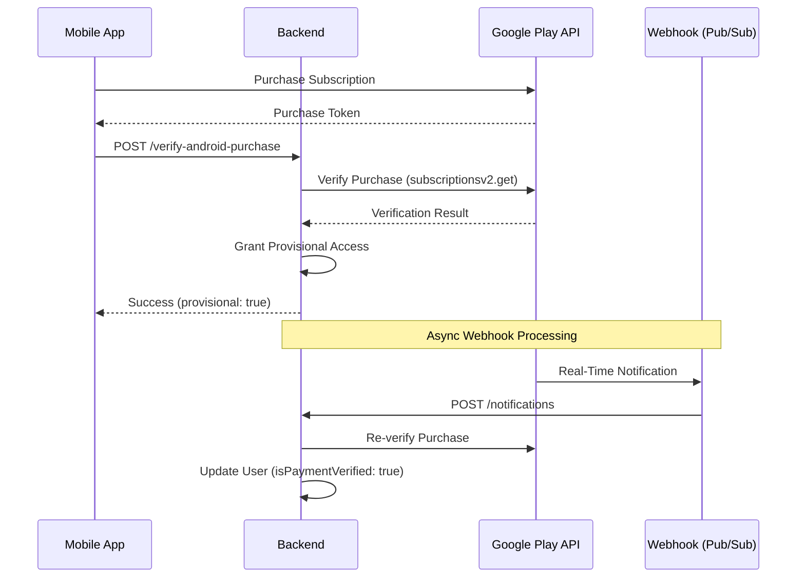

# Subscription System Documentation

> Comprehensive guide to the Haazri subscription and billing system.

---

## Table of Contents

1. [Overview](#overview)
2. [Available Plans](#available-plans)
3. [Plan Limits Configuration](#plan-limits-configuration)
4. [User Schema - Subscription Fields](#user-schema---subscription-fields)
5. [Google Play Billing Integration](#google-play-billing-integration)
6. [Subscription Lifecycle & Webhooks](#subscription-lifecycle--webhooks)
7. [Frontend Components](#frontend-components)
8. [API Endpoints](#api-endpoints)
9. [Limit Enforcement](#limit-enforcement)
10. [Grace Period & Cancellation Handling](#grace-period--cancellation-handling)

---

## Overview

The Haazri subscription system manages user plans, billing cycles, and feature limits. It integrates with **Google Play Billing** for Android in-app purchases and supports both monthly and yearly billing cycles.

### Key Features
- 6 distinct subscription tiers with progressive limits
- Google Play real-time developer notifications (RTDN) via webhooks
- Automatic plan expiration and downgrade handling
- Custom limits for Enterprise and Business plans
- Plan history tracking for audit purposes

---

## Available Plans

| Plan | Display Name | Max Sites | Employee Limit | Pricing |
|------|-------------|-----------|----------------|---------|
| `free` | Haazri Basic | 1 | 10 per site | Free |
| `lite` | Haazri Lite | 1 | 17 per site | Entry-tier |
| `pro` | Contractor Pro | 3 | 40 per site | ₹299/month |
| `premium` | Haazri Automate | 6 | 80 per site | ₹499/month |
| `business` | Business Plan | 10 | 100 **total** (across all sites) | Custom |
| `enterprise` | Enterprise | 15 (default) | 200 per site (default) | Custom |

> [!IMPORTANT]
> The **Business** plan uses a **total employee count** across all sites, not a per-site limit. This is different from all other plans.

---

## Plan Limits Configuration

**File:** [planLimits.js](file:///c:/Users/SHASHI%20KANT/CODE/Github/FinanceDashbord/Backend/config/planLimits.js)

```javascript
const PLAN_LIMITS = {
  free: {
    maxSites: 1,
    maxEmployeesPerSite: 10,
    displayName: "Haazri Basic",
  },
  lite: {
    maxSites: 1,
    maxEmployeesPerSite: 17,
    displayName: "Haazri Lite",
  },
  pro: {
    maxSites: 3,
    maxEmployeesPerSite: 40,
    displayName: "Contractor Pro",
  },
  premium: {
    maxSites: 6,
    maxEmployeesPerSite: 80,
    displayName: "Haazri Automate",
  },
  business: {
    maxSites: 10,
    maxTotalEmployees: 100, // Total employees across ALL sites
    displayName: "Business Plan",
  },
  enterprise: {
    maxSites: 15,          // Default fallback
    maxEmployeesPerSite: 200, // Default fallback
    displayName: "Enterprise",
  },
};
```

---

## User Schema - Subscription Fields

**File:** [Userschema.js](file:///c:/Users/SHASHI%20KANT/CODE/Github/FinanceDashbord/Backend/models/Userschema.js)

### Core Plan Fields

| Field | Type | Description |
|-------|------|-------------|
| `plan` | String (enum) | Current plan: `free`, `lite`, `pro`, `premium`, `business`, `enterprise` |
| `planActivatedAt` | Date | When the current plan was activated |
| `billing_cycle` | String (enum) | `monthly` or `yearly` |
| `planExpiresAt` | Date | Expiration date of the current plan |

### Payment Status Flags

| Field | Type | Default | Description |
|-------|------|---------|-------------|
| `isPaymentVerified` | Boolean | `false` | Whether payment is verified via webhook |
| `isTrial` | Boolean | `false` | Whether user is on a trial period |
| `isCancelled` | Boolean | `false` | Whether auto-renewal is cancelled |
| `isGrace` | Boolean | `false` | Whether user is in grace period |
| `graceExpiresAt` | Date | `null` | Grace period end date |

### Purchase Tracking

| Field | Type | Description |
|-------|------|-------------|
| `planSource` | String (enum) | `google_play`, `app_store`, `web`, `manual` |
| `purchaseToken` | String | Current purchase token from Google Play |
| `lastPurchaseToken` | String | Previous purchase token for renewal verification |

### Custom Limits (Enterprise/Business)

```javascript
// Enterprise custom limits
enterpriseLimits: {
  maxActiveSites: { type: Number, default: 10 },
  maxEmployeesPerSite: { type: Number, default: 100 },
}

// Business custom limits (uses TOTAL employees)
businessLimits: {
  maxActiveSites: { type: Number, default: 10 },
  maxTotalEmployees: { type: Number, default: 100 },
}
```

### Plan History

Each user maintains a complete history of all subscription purchases:

```javascript
planHistory: [{
  plan: String,           // Plan purchased
  purchasedAt: Date,      // Purchase timestamp
  expiresAt: Date,        // Expiration date
  transactionId: String,  // Purchase token
  platform: String,       // 'android', 'ios', 'web'
  source: String,         // 'google_play', 'app_store', etc.
  isActive: Boolean,      // Whether this entry is active
  originalProductId: String, // Google Play product ID
  subscriptionId: String,    // Google Play subscription ID
  regionCode: String,        // Purchase region
  verificationData: {
    subscriptionState: String,
    startTime: Date,
  }
}]
```

---

## Google Play Billing Integration

**File:** [playPurchase.js](file:///c:/Users/SHASHI%20KANT/CODE/Github/FinanceDashbord/Backend/Routes/playPurchase.js)

### Product ID Mapping

| Google Play Product ID | Internal Plan |
|------------------------|---------------|
| `pro_monthly` | `pro` |
| `haazri_automate` | `premium` |
| `haazri_lite` / `lite_monthly` | `lite` |

### Package Name
```
com.sitehaazri.app
```

### Architecture



---

## Subscription Lifecycle & Webhooks

### Notification Types

The system handles 12+ Google Play notification types:

| Type | Code | Action |
|------|------|--------|
| `SUBSCRIPTION_PURCHASED` | 4 | Activate plan, record history, send webhook |
| `SUBSCRIPTION_RENEWED` | 2 | Extend expiry, update verification |
| `SUBSCRIPTION_CANCELED` | 3 | Set `isCancelled: true` (access continues until expiry) |
| `SUBSCRIPTION_EXPIRED` | 13 | Revert to free plan |
| `SUBSCRIPTION_REVOKED` | 12 | Immediate revert to free plan (refund) |
| `SUBSCRIPTION_RECOVERED` | 1 | Re-activate from grace period |
| `SUBSCRIPTION_RESTARTED` | 7 | Re-activate after pause |
| `SUBSCRIPTION_IN_GRACE_PERIOD` | 6 | Set `isGrace: true` |
| `SUBSCRIPTION_ON_HOLD` | 5 | Mark payment pending |
| `SUBSCRIPTION_PAUSED` | 10 | Pause subscription |
| `SUBSCRIPTION_DEFERRED` | 9 | Update expiry (deferred purchase) |
| `SUBSCRIPTION_PRICE_CHANGE_UPDATED` | 19 | Refresh plan details |

### Stale Token Protection

The webhook handler includes protection against stale notifications:

```javascript
// Ignore notifications for old purchase tokens
if (notification.purchaseToken !== user.purchaseToken) {
  message = `Ignoring stale notification. User is on a newer plan.`;
  return { success: true, message, updateData: {} };
}
```

This prevents scenarios where:
- User upgrades → gets new token
- Old token's EXPIRED notification arrives
- Without protection, this would wrongly downgrade the user

---

## Frontend Components

### Subscription Utilities

**File:** [subscriptionUtils.js](file:///c:/Users/SHASHI%20KANT/CODE/Github/FinanceDashbord/Frontend/src/utils/subscriptionUtils.js)

```javascript
// Check if user can add more employees
checkEmployeeLimit(userPlan, currentCount, additionalCount, customLimits)
// Returns: { canAdd, remainingSlots, isApproachingLimit, planName, maxEmployees }

// Get warning message for UI
getSubscriptionWarning(userPlan, currentCount, customLimits)
// Returns: Warning string or null

// Check if upgrade modal should show
shouldShowSubscriptionModal(userPlan, currentCount, additionalCount, customLimits)
// Returns: boolean
```

### Subscription Modal

**File:** [SubscriptionModal.jsx](file:///c:/Users/SHASHI%20KANT/CODE/Github/FinanceDashbord/Frontend/src/components/SubscriptionModal.jsx)

A modal component that displays when users hit their plan limits:

- Shows current employee count
- Displays upgrade options (Contractor Pro, Haazri Automate)
- Redirects to `/payments` page on upgrade click

---

## API Endpoints

### User-Facing Endpoints

| Method | Endpoint | Description |
|--------|----------|-------------|
| `POST` | `/api/playPurchase/verify-android-purchase` | Verify and activate purchase |
| `GET` | `/api/playPurchase/plan` | Get current plan info |

### Webhook Endpoint

| Method | Endpoint | Description |
|--------|----------|-------------|
| `POST` | `/api/playPurchase/notifications` | Google Play Pub/Sub webhook |

### Admin Endpoints

| Method | Endpoint | Description |
|--------|----------|-------------|
| `POST` | `/api/playPurchase/admin/manual-verify` | Manually verify a purchase (super-admin only) |
| `GET` | `/api/playPurchase/debug-user/:userId` | Debug subscription info (dev only) |

### Plan Response Format

```javascript
// GET /api/playPurchase/plan
{
  plan: "pro",
  billing_cycle: "monthly",
  planExpiry: "2025-01-24T00:00:00.000Z",
  planActivatedAt: "2024-12-24T00:00:00.000Z",
  planSource: "google_play",
  isPaymentVerified: true,
  isTrial: false,
  isCancelled: false,
  isGrace: false,
  purchaseToken: "abc123...",
  
  // Only for enterprise plans
  limits: {
    maxActiveSites: 15,
    maxEmployeesPerSite: 100
  }
}
```

---

## Limit Enforcement

Plan limits are enforced at multiple levels:

### 1. Backend - Employee Addition

**File:** [EmployeeDetails.js](file:///c:/Users/SHASHI%20KANT/CODE/Github/FinanceDashbord/Backend/Routes/EmployeeDetails.js)

```javascript
const PLAN_LIMITS = require("../config/planLimits");

// During employee creation
const currentPlanLimits = PLAN_LIMITS[plan] || PLAN_LIMITS.free;

// For business plan - check total employees
if (plan === 'business') {
  const totalLimit = req.user.businessLimits?.maxTotalEmployees || 100;
  // Aggregate count across all active sites
}

// For other plans - check per-site
maxEmployees = req.user.enterpriseLimits?.maxEmployeesPerSite 
  || PLAN_LIMITS[plan].maxEmployeesPerSite;
```

### 2. Backend - Site Activation

**File:** [dashboard.js](file:///c:/Users/SHASHI%20KANT/CODE/Github/FinanceDashbord/Backend/Routes/dashboard.js)

```javascript
const currentPlanLimits = PLAN_LIMITS[plan] || PLAN_LIMITS.free;

if (plan === 'enterprise') {
  limit = userdata.enterpriseLimits?.maxActiveSites 
    || PLAN_LIMITS.enterprise.maxSites;
} else {
  limit = currentPlanLimits.maxSites;
}
```

### 3. Auth Middleware - Plan Expiration

**File:** [auth.js](file:///c:/Users/SHASHI%20KANT/CODE/Github/FinanceDashbord/Backend/Middleware/auth.js)

The auth middleware automatically checks for expired plans:

```javascript
// If plan has expired
if (currentDate > expirationDate) {
  await User.findByIdAndUpdate(userId, {
    plan: 'free',
    isTrial: false,
    isCancelled: false,
    isGrace: false,
    planExpiresAt: null
  });
}
```

---

## Grace Period & Cancellation Handling

### Grace Period Flow

1. Payment fails → Google sends `SUBSCRIPTION_IN_GRACE_PERIOD`
2. System sets `isGrace: true` and `graceExpiresAt`
3. User retains access during grace period
4. If payment succeeds → `SUBSCRIPTION_RECOVERED` → Grace cleared
5. If grace expires → `SUBSCRIPTION_EXPIRED` → Downgrade to free

### Cancellation Flow

1. User cancels in Play Store → `SUBSCRIPTION_CANCELED`
2. System sets `isCancelled: true`
3. **User retains access until `planExpiresAt`**
4. On expiry → `SUBSCRIPTION_EXPIRED` → Downgrade to free

> [!NOTE]
> Cancellation does NOT immediately revoke access. Users keep their plan until the paid period ends.

### Refund Flow

1. Google issues refund → `SUBSCRIPTION_REVOKED`
2. System immediately reverts to free plan
3. Cancellation webhook sent for tracking

---

## Environment Variables

```bash
# Google Play Service Account
PLAY_BILLING_SERVICE_KEY={"type":"service_account",...}

# Webhook Authentication
GOOGLE_WEBHOOK_AUDIENCE=https://your-api.com/api/playPurchase/notifications

# JWT Secret for API authentication
JWT_SECRET=your-jwt-secret
```

---

## Related Files Summary

| File | Purpose |
|------|---------|
| `Backend/config/planLimits.js` | Central plan limits configuration |
| `Backend/models/Userschema.js` | User schema with subscription fields |
| `Backend/Routes/playPurchase.js` | Google Play billing routes & webhooks |
| `Backend/Middleware/auth.js` | Plan info injection & expiration check |
| `Backend/Routes/EmployeeDetails.js` | Employee limit enforcement |
| `Backend/Routes/dashboard.js` | Site limit enforcement |
| `Backend/Routes/config.js` | Plan limits API endpoint |
| `Frontend/src/utils/subscriptionUtils.js` | Frontend limit checking |
| `Frontend/src/components/SubscriptionModal.jsx` | Upgrade prompt modal |

---

*Last updated: December 24, 2025*
